上一篇《基于 Apache Seata 的 2PC 分布式事务实现原理与常见故障排查》梳理了 2PC 的理论边界、Seata XA 与 AT 的对比，以及生产排障经验。本文把镜头拉近到 **AT 模式的内核**，聚焦五个容易含糊的问题：

1. 全局锁到底锁了什么、怎么支撑写隔离？
2. 一阶段已经本地提交，**读已提交**是怎么做到的？
3. 抢不到全局锁时，**重试与回滚**如何流转？
4. 二阶段回滚发现数据被人改过，**脏写校验**怎么处理？
5. 全局锁**何时释放**、释放不了又会怎样？

---

## 一、角色边界与调用模型

Seata 把分布式事务的角色抽象为三层：

- **TC（Transaction Coordinator）**：独立部署的 Seata-Server，维护全局事务与分支事务状态，持有全局锁。
- **TM（Transaction Manager）**：嵌在事务发起方，`@GlobalTransactional` 所在，负责开启/提交/回滚全局事务。
- **RM（Resource Manager）**：嵌在各参与服务中，管理本地资源、注册分支、执行 TC 下达的提交/回滚。

### 参与方是"独立数据源"的服务

AT 模式里被协调的各个服务，通常是**独立的微服务、各自连接自己的数据库**，通过 RPC 相互调用：

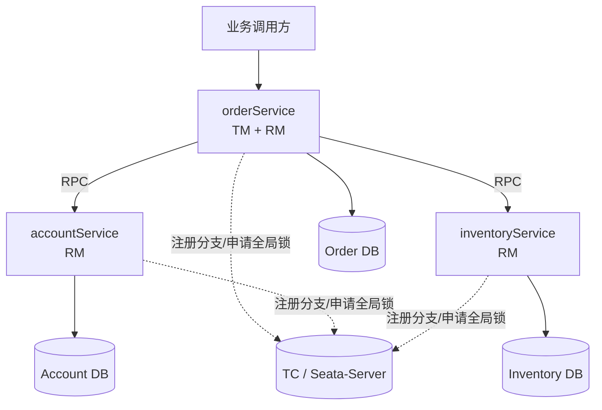

- 发起 `@GlobalTransactional` 的服务（图中 `orderService`）**同时是 TM 和 RM**：既开启全局事务，自己的本地事务也是一条分支。
- 其余服务是纯 RM。

**为什么必须是独立数据源？** 如果几个操作在同一进程、同一数据库里，那本来就是一个本地事务，用 `@Transactional` 就够了。分布式事务的意义正在于**跨服务、跨库**。

> **边界情况**：同一进程内配置多个 `DataSource`（多数据源）时，各数据源算不同的 RM，并不一定是远程调用。但典型场景就是远程微服务。

---

## 二、全局锁：写隔离的基石

AT 模式一阶段就本地提交，物理行锁随即释放。为了保证"两个全局事务不会互相脏写"，Seata 引入了 **TC 侧维护的全局锁（Global Lock）**。

### 逻辑模型

全局锁是**行级**的，逻辑结构是三层定位：

```
resourceId  →  tableName  →  pk  →  持有者(xid)
```

- 锁粒度 = `(资源, 表, 主键)` 这一条记录，不同行互不阻塞。
- `resourceId` 在 AT/XA 模式下取**数据库连接 URL**，天然隔离不同库；TCC 模式下取 `@TwoPhaseBusinessAction` 的 name。

### 申请时机

全局锁在**一阶段本地事务提交之前**申请：

```
执行业务 SQL → 写 undo_log(前镜像/后镜像) → 向 TC 注册分支并申请全局锁
   ├─ 成功 → 本地提交，进入二阶段等待
   └─ 冲突 → 进入重试（见第四节）
```

**重入语义**：同一个全局事务（相同 `xid`）再次申请同一行锁是允许的，只有**其他 xid** 才构成冲突。这也是判定冲突的依据。

### 申请与释放的完整时序

全局锁的生命周期**横跨两个阶段**：一阶段本地事务提交前申请，直到二阶段全局提交/回滚完成后才由 TC 释放。因此它的持有时间**远长于物理行锁**（物理行锁在一阶段本地提交时即释放）。

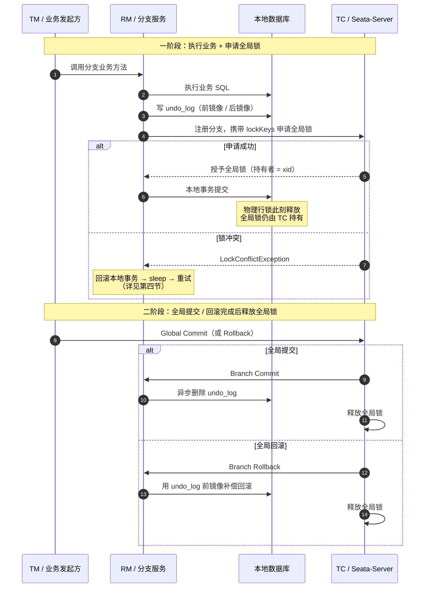

:::note
注意时序中的关键不对称：**一阶段本地提交释放物理行锁，但全局锁要等到二阶段结束才释放**。这正是 AT 模式"用全局锁补位物理锁"的核心——也正是长事务会长时间占用全局锁、拖累并发的原因。
:::

### 超时释放与异常路径

全局事务带超时时间（TM 通过 `@GlobalTransactional(timeoutMills = ...)` 声明，随 `GlobalBegin` 交给 TC）。TC 有一个**定时任务**专门扫描"已超时且尚未回滚完成"的全局事务，一旦发现就将其置为 `TimeoutRollbacking` 并主动发起回滚——**这是全局锁在"业务卡住"时的主要释放途径**。

正常回滚完成即释放锁，进入终态 `TimeoutRollbacked`，`global_table` 记录被删除。真正的坑在**异常路径**：

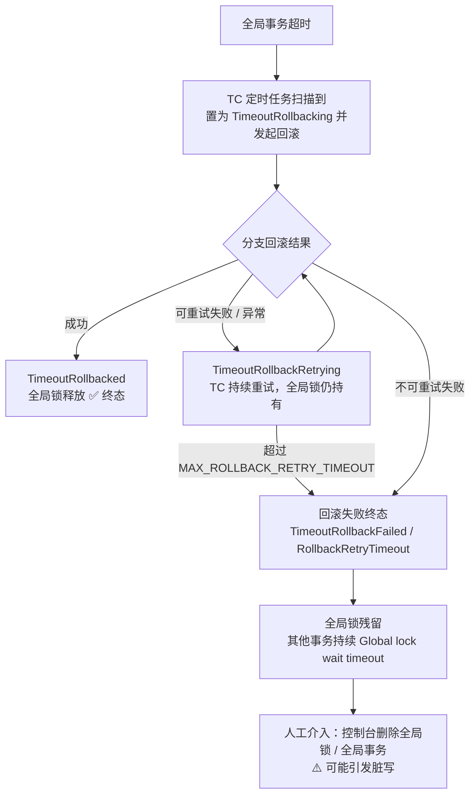

**触发 `TimeoutRollbackRetrying` 的典型原因：**

- RM 进程宕机 / 网络分区，TC 通知不到分支；
- 分支回滚抛异常（如第六节的脏写校验失败 `SQLUndoDirtyException`）；
- 分支返回可重试失败状态（`PhaseTwo_RollbackFailed_Retryable`）。

**与普通回滚重试的区别**：超时回滚失败进 `TimeoutRollbackRetrying`，非超时回滚失败进 `RollbackRetrying`——两条独立的重试路径。

**终态失败**：重试超过 `MAX_ROLLBACK_RETRY_TIMEOUT`（进入 `RollbackRetryTimeout`），或分支返回不可重试失败（`PhaseTwo_RollbackFailed_Unretryable`，超时路径下进入 `TimeoutRollbackFailed`），全局事务进入失败终态，**自动流程停止、全局锁不再自动释放**。

:::note
关键差异：数据库物理行锁有 `innodb_lock_wait_timeout` 兜底自动释放，而 **Seata 的全局锁没有独立的 TTL / 自动过期机制**——它只随全局事务走完二阶段而释放。因此回滚一旦卡死，锁就会**悬挂**，直到人工处理。这是 AT 模式线上事故的高发区。
:::

需要强调：回滚失败时**持锁不释放是 Seata 的设计内保守行为**——宁可持锁、也不留下数据不一致，代价就是必须有人工兜底。它与"已提交却锁不释放"那类并发竞态缺陷是两回事，处置方式也不同。

**恢复与处置：**

- **TC 自愈**：db / raft 模式下，TC 重启会扫描存储中处于 `TimeoutRollbacking` / `TimeoutRollbackRetrying` 的会话继续驱动；**file 模式重启丢状态，最危险**。
- **控制台人工处理**（Seata 控制台「事务控制及全局锁」）：
  - **删除全局事务**：AT 模式会对分支发起 commit 触发 undo_log 删除、**释放全局锁**（首选）；
  - **删除全局锁**：直接删锁记录，**可能脏写**，仅在前者无法进行时使用；
  - **强制删除**：跳过状态检查直接删 Server 端数据，**脏写风险最高**。
- **排查建议**：若配置正常却频繁超时，检查 TC 集群与数据库的**时区是否一致**（不一致会导致超时判断异常）。

### 对照：另一类锁残留——并发竞态缺陷

上一节讲的是"回滚失败 → 保守持锁"。但"锁不释放"是一类**症状**，不止一个病因。另一类是**并发竞态缺陷**：全局事务明明已经**提交成功**，锁却没释放。

机理：TC 释放全局锁时会遍历会话下的分支列表逐个释放。若此时另一个线程（如定时任务）并发地移除分支，而遍历与删除之间**没有会话锁保护**，两者就会交错——解锁半途而废（遍历中断/漏项），而会话生命周期已走到终态并被移除，残留的锁从此无人认领，连控制台都查不到持锁者（会话已删）。

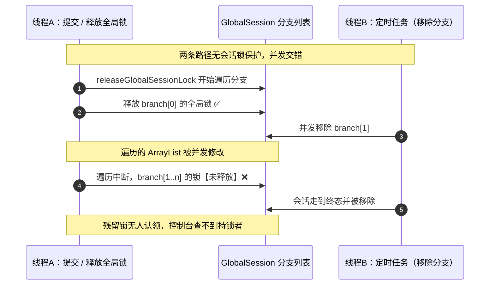

两类锁残留的对比：

| 维度 | 并发竞态缺陷 | 设计内保守持锁 |
| :--- | :--- | :--- |
| 触发路径 | 全局**提交**（AsyncCommitting） | 全局**回滚失败** |
| 会话状态 | 已到终态（如 `Committed`） | 停在失败终态（`RollbackFailed` 等） |
| 残留原因 | 解锁遍历与删分支并发交错，解锁半途而废 | **有意**不释放，避免数据不一致 |
| 控制台能否查到持锁者 | 查不到（会话已删） | 能查到（会话仍在） |
| 性质 | 缺陷（上游 PR #8201 修复） | 设计行为 |
| 处置 | 升级 / backport 修复；重启可临时清 | 人工补偿 + 清理 |

**识别要点**：日志显示"事务已提交成功"却仍报 `Global lock ... is holding by ...`，且控制台**查不到**持锁会话 → 大概率是并发竞态缺陷；若控制台**能查到**停在 `RollbackFailed` 的会话 → 是设计内保守持锁。

---

## 三、全局读隔离：默认读未提交，如何做到读已提交

这是 AT 模式最容易困惑的一点：**一阶段数据已经本地提交、别人已经能看见了，"读已提交"还怎么实现？**

### 核心思路：不藏数据，让读者等

Seata 的答案是——**用全局锁当门闩，让想读的人排队**：

- 数据库原生读已提交靠"让写者的未提交数据不可见"；
- Seata 的数据已经可见，只能靠"**让读者等到全局事务尘埃落定**"来达到同样的可观测结果。

| 维度 | 数据库原生读已提交 | Seata 全局读已提交 |
| :--- | :--- | :--- |
| 手段 | 写者未提交数据**不可见** | 数据可见，**让读者等** |
| 靠什么拦 | 写者的**行锁** | **全局锁**（存在 TC） |
| 拦到什么时候 | 写者本地提交/回滚 | 全局事务**全局**提交/回滚 |

### 隔离的两个层次

```mermaid
graph TD
    subgraph 全局事务隔离（Seata 自定义语义）
        W[写隔离：全局锁，防脏写]
        R[读隔离：默认读未提交]
        RC[读已提交：SELECT FOR UPDATE 申请全局锁]
    end
    subgraph 本地事务隔离（数据库自身）
        DB[各 RM 的本地事务<br/>如 MySQL REPEATABLE READ]
    end
    全局事务隔离 --> 建立在 --> 本地事务隔离
```

### 时序对比

设库存表 `stock`，`id=1` 初始 `qty=100`。全局事务 G1 扣库存 `100→90`，G2 想读这行。

**默认（读未提交）**：

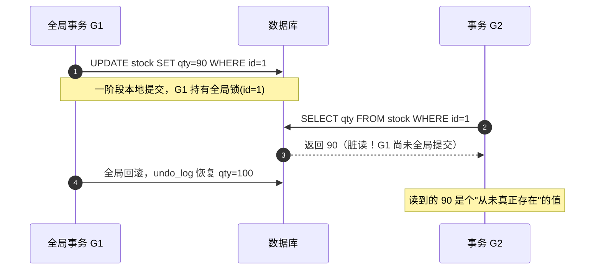

**读已提交（`FOR UPDATE`）**：

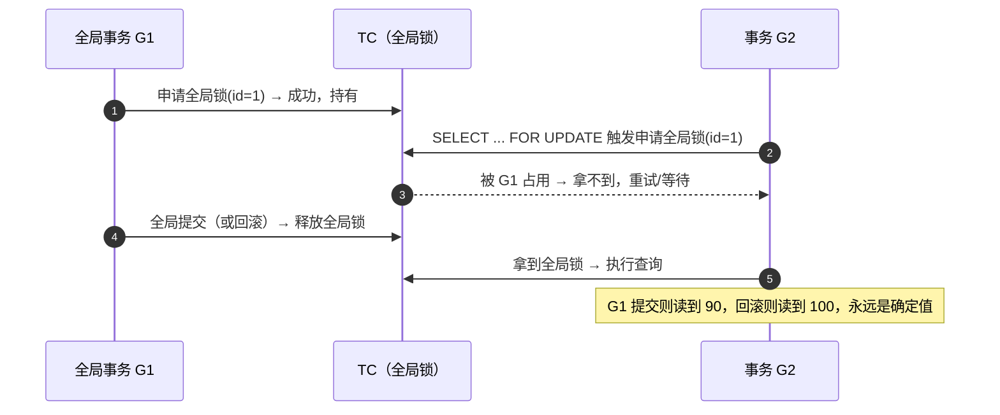

### 为什么必须是 `SELECT ... FOR UPDATE`

关键在于：**一阶段本地提交后，G1 的数据库行锁已经释放**，普通 `SELECT` 不会被拦住。

- 普通 `SELECT`：Seata **不代理**，不加全局锁，直接读 DB → 读到中间值 = **读未提交**；
- `SELECT ... FOR UPDATE`：Seata 会**代理**，执行前申请**全局锁**，被占用就重试/等待。

因此真正起作用的是 **TC 的全局锁**，`FOR UPDATE` 只是让 Seata 能拦截的载体。

### `@GlobalLock`

如果读者本身没有 `@GlobalTransactional`（只是普通本地读事务），默认不会检查全局锁。加 `@GlobalLock` 注解即告诉 Seata："即使我没开全局事务，也请帮我检查全局锁。" 配合 `SELECT ... FOR UPDATE` 使用，本地事务也能获得读已提交。

### 为什么说"尽力而为"

它**不是会话/事务级的开关**，而是**逐条 SQL** 的事：

| 写法 | 效果 |
| :--- | :--- |
| `SELECT ...` | 读未提交（默认） |
| `SELECT ... FOR UPDATE` + `@GlobalLock` | 读已提交 |

漏掉一条，那条读就是读未提交。所以需要业务上主动梳理：哪些读必须看到确定值。

:::note
前提条件：Seata 的保证建立在本地库隔离级别 **≥ READ COMMITTED** 之上。若本地库是 READ UNCOMMITTED，全局的读写隔离都会进一步退化。
:::

---

## 四、锁冲突重试流程

### 触发点

冲突发生在**一阶段本地事务提交前抢全局锁**的那一刻：

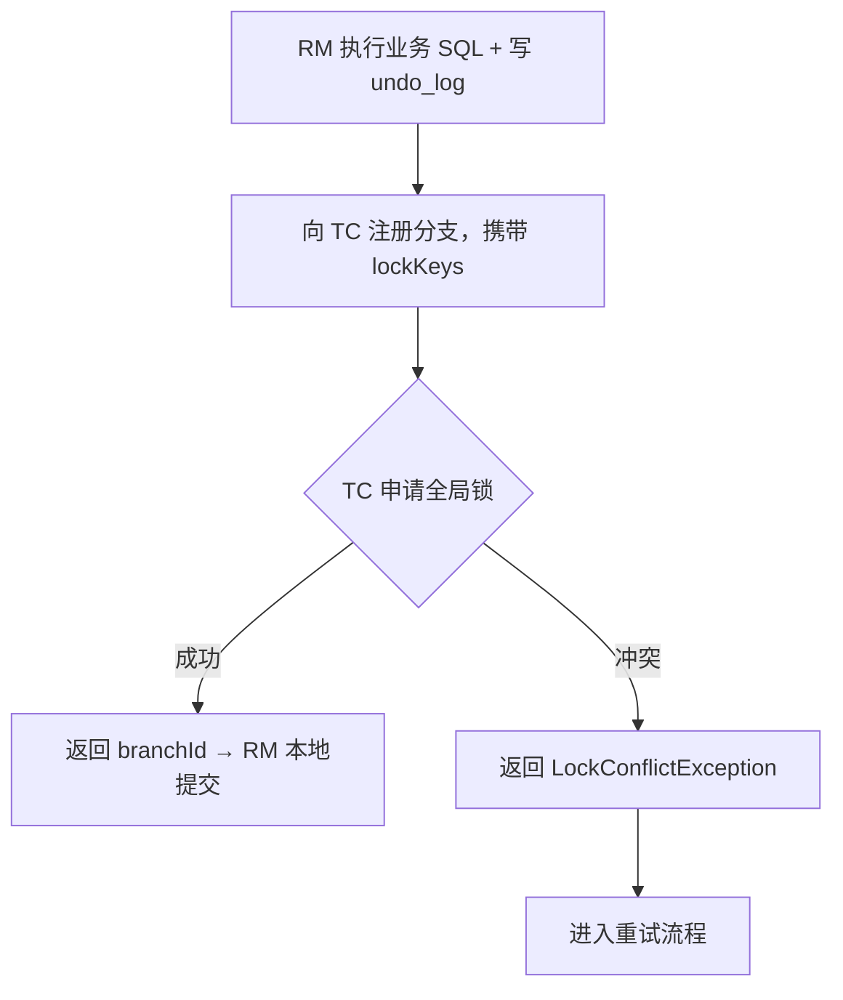

冲突的本质：这行数据正被另一个**还没结束的全局事务**占着全局锁。

### 重试循环（RM 侧）

RM 收到冲突后由 `LockRetryController` 驱动：

```java
for (int i = retryTimes; i > 0; i--) {
    try {
        // 重新执行整个本地事务
        //   执行 SQL + 写 undo_log
        //   注册分支 / 申请全局锁
        //   本地提交
        return;                 // 成功，跳出
    } catch (LockConflictException e) {
        rollbackLocalTransaction();   // 回滚本次尝试
        sleep(retryInterval);         // 等待
        // 下一轮重来
    }
}
throw new LockConflictException();    // 重试耗尽，抛给应用
```

**三个关键点：**

1. 重试的是**整个本地事务**，不是只重试加锁那一下——每轮都会**重新执行业务 SQL**、重新生成 undo_log。
2. 每轮是一个**全新的本地事务**：上一轮失败后本地回滚，undo_log 那行也一并回滚，不留脏数据。
3. 对应用**透明**：只要某轮抢到锁就正常返回；只有全部失败才抛异常。

### 参数

| 配置项 | 默认值 | 含义 |
| :--- | :--- | :--- |
| `client.rm.lock.retryInterval` | `10` (ms) | 每次重试之间的等待间隔 |
| `client.rm.lock.retryTimes` | `30` | 最大重试次数 |
| `client.rm.lock.retryPolicyBranchRollbackOnConflict` | `true` | 冲突时是否回滚本地事务再重试 |

按默认值，最长等待约 `30 × 10ms = 300ms`，超时即失败。

### 冲突时"回滚"还是"死等"

`retryPolicyBranchRollbackOnConflict` 决定重试时**本地行锁要不要放掉**：

- **`true`（默认）——回滚本地事务再重试**：释放本地行锁让对手推进，**避免死锁**，代价是反复回滚重来。
- **`false`——不回滚，保持本地行锁继续等全局锁**：少一次回滚，但容易与对手**互相持有对方所需行锁形成死锁**。

经典死锁场景：G1 本地锁 A、G2 本地锁 B；G1 想要 B 的全局锁、G2 想要 A 的全局锁。若双方死等则僵持；若双方回滚重试，至少一方能让路，系统继续推进——这正是默认选 `true` 的原因。

### 重试耗尽之后

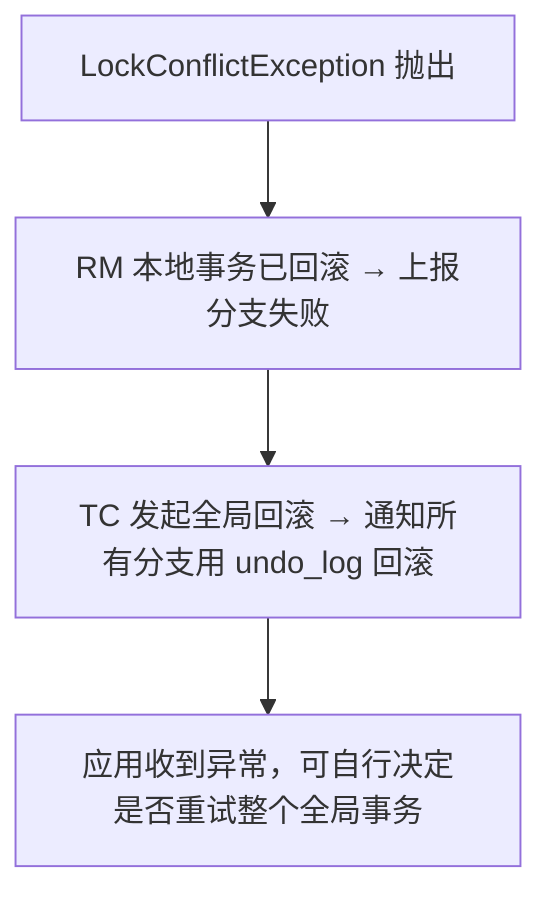

失败的分支自身已回滚干净，同时触发**整个全局事务回滚**，其他已成功的一阶段分支也会被 undo_log 补偿。

### 调参取舍

- 重试窗口太短（默认才 300ms）：对手稍慢就失败，业务报错多；
- 调大 `retryTimes` / `retryInterval`：能扛更长锁等待，但**请求阻塞更久**、吞吐下降，极端情况线程堆积；
- **根本解法**：缩短全局事务持锁时间——别在全局事务里做远程调用、长耗时计算、大批量更新。

---

## 五、TC 侧 LockManager 存储结构

全局锁的逻辑模型统一为 `resourceId → 表 → 主键 → xid`，三种存储模式只是把这套模型落到不同介质上。

### 类层次

```
LockManager (接口，TC 侧)
   └── AbstractLockManager (解析 lockKey → RowLock 列表，委托给 Locker)
          ├── FileLockManager     (FileLocker)      ← 默认，内存+文件
          ├── DataBaseLockManager (DataBaseLocker)  ← 集群推荐
          └── RedisLockManager    (RedisLocker)     ← 高并发
```

`AbstractLockManager` 自身不存锁，只负责把 `lockKey` 解析成 `List<RowLock>`。

### lockKey 格式与解析

| 场景 | 格式 | 示例 |
| :--- | :--- | :--- |
| 单列主键 | `表名:主键1,主键2` | `account_info:1,2` |
| 多列主键 | 列值用 `_` 连接 | `account_info:1_1001,2_1002` |
| 多表 | 用 `;` 分隔 | `account_flow:1,2;account_info:1,2` |

解析逻辑（`AbstractLockManager#collectRowLocks`）：

```java
String[] tableGroupedLockKeys = lockKey.split(";");          // 按表拆
for (String tableGroupedLockKey : tableGroupedLockKeys) {
    int idx = tableGroupedLockKey.indexOf(":");
    String tableName = tableGroupedLockKey.substring(0, idx); // 表名
    String[] pks = tableGroupedLockKey.substring(idx + 1).split(","); // 拆主键
    for (String pk : pks) {
        RowLock rowLock = new RowLock();
        rowLock.setResourceId(resourceId);
        rowLock.setTableName(tableName);
        rowLock.setPk(pk);
        locks.add(rowLock);   // 一个主键 = 一个 RowLock = 一个锁点
    }
}
```

### 三种存储模式

**1. File 模式（默认）**——内存嵌套 `ConcurrentMap`：

```
resourceId → tableName → bucketId(0~127) → BucketLockMap(pk → transactionId)
```

- 按主键哈希分散到 **128 个桶**，降低并发写同一 Map 的争用；
- `LOCK_MAP` 是 `static`，即该 TC 上所有事务共享；内存结构，TC 重启会丢锁。

**2. DB 模式（集群推荐）**——落到 `lock_table`：

```sql
CREATE TABLE lock_table (
    row_key        VARCHAR(128) NOT NULL,  -- resource_id+table_name+pk
    xid            VARCHAR(128),           -- 持有者
    transaction_id BIGINT,
    branch_id      BIGINT NOT NULL,
    resource_id    VARCHAR(256),
    table_name     VARCHAR(32),
    pk             VARCHAR(36),
    gmt_create     DATETIME,
    gmt_modified   DATETIME,
    PRIMARY KEY (row_key),
    KEY idx_branch_id (branch_id)
);
```

`row_key` 生成规则：

```
row_key = resourceId + "^^^" + tableName + "^^^" + pk
```

示例：

```
jdbc:mysql://host:3306/db_account^^^account_info^^^1
```

`row_key` 作为主键，天然保证"一行一锁"——插入同一 `row_key` 就会主键冲突，这正是冲突判定的基础。

> **坑**：`row_key` 默认 `VARCHAR(128)`。当 `resourceId`（连接 URL）很长、或主键用了 UUID 时，会报 `Data too long for column 'row_key'`。要么调大字段，要么缩短 resourceId / 主键。

**3. Redis 模式**——用 Hash 存储：

```
Key   = SEATA_LOCK_{resourceId}:{tableName}
Field = pk
Value = 锁信息
```

加锁依赖 Redis 原子操作（`HSETNX` / Lua），性能最高，适合秒杀类高并发。

### 三个核心操作

**acquireLock（分支注册时加锁）**：

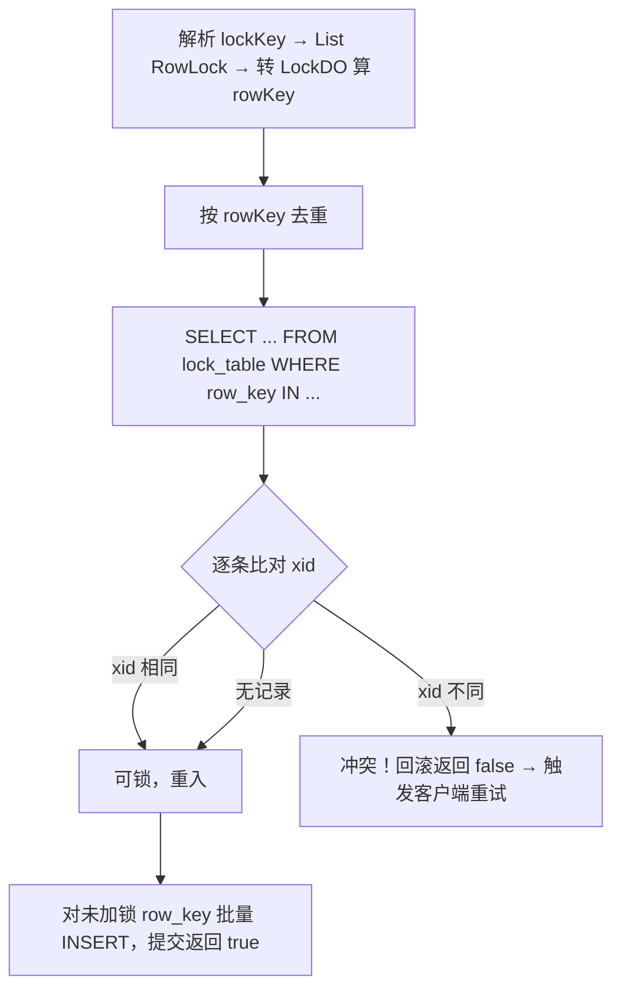

**isLockable（给 `SELECT FOR UPDATE` 查询用）**：解析后判断这些行是否被**其他 xid** 持有——这就是第三节"读已提交"蹭全局锁的入口。

**releaseLock（全局提交/回滚时）**：

```sql
-- DB 模式
DELETE FROM lock_table WHERE xid = ? AND row_key IN (...);
```

`releaseGlobalSessionLock` 会遍历该全局事务的所有 `BranchSession` 逐个释放。

### 设计要点

| 设计 | 原因 |
| :--- | :--- |
| 锁粒度 = `(resource, table, pk)` | 行级并发，不同行互不阻塞；resourceId 隔离不同库 |
| 记录持有者 `xid` | 支持**重入**（同 xid 放行）+ 判定**冲突**（异 xid 阻塞） |
| File 模式 128 分桶 | 降低高并发下单个 Map 的锁争用 |
| DB 模式 `row_key` 作主键 | 用主键唯一约束天然保证"一行一锁" |

---

## 六、二阶段回滚与脏写校验

### 为什么有了全局锁还会脏写

全局锁理论上防脏写，但**不是绝对的**：

- **非 Seata 事务**：运维直接改库、定时脚本、其他应用/框架写同一行——它们根本不申请全局锁；
- **全局锁丢失**：File 模式下 TC 重启，内存锁没了；
- **历史脏数据**：之前关过校验、或与其他模式（TCC/Saga）混用留下的。

所以回滚时加了最后一道防线：**脏写校验**。

### 校验逻辑：三路判断

回滚流程：TC 通知分支回滚 → RM 读 `undo_log` → **构造补偿 SQL 之前**先校验：

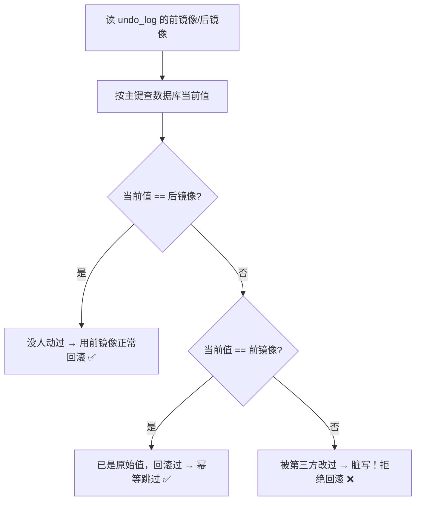

| 情况 | 当前值 | 判定 | 处理 |
| :--- | :--- | :--- | :--- |
| ① 正常 | == 后镜像 | 数据还是"我们改完的样子" | 用前镜像恢复 ✅ |
| ② 幂等 | == 前镜像 | 已回滚过（重复回滚） | 直接跳过 ✅ |
| ③ **脏写** | 都不是 | 被**别人**改过 | **拒绝回滚，抛异常** ❌ |

**为什么跟"后镜像"比？** 后镜像是一阶段提交后的状态。当前值仍等于它，就证明"从提交到现在没人碰过这行"，回滚安全。一旦对不上，回滚就会**覆盖别人的修改**（lost update），必须拦住。

情况 ② 让回滚**幂等**：TC 重试或消息重复投递时，不会把"已回滚过"误判成脏写。

### 具体例子

初始 `qty = 100`：

```
G1 分支：扣 10
   undo_log: before={qty:100}, after={qty:90}
   一阶段本地提交 → qty=90

运维脚本（不走 Seata）直接改库：
   UPDATE stock SET qty=80

G1 回滚 → 校验当前值 qty=80：
   80 == after(90)?   ✗
   80 == before(100)? ✗
   → 脏写！抛 SQLUndoDirtyException，拒绝回滚
```

若强行回滚，会用前镜像把 `qty` 还原成 `100`，直接冲掉运维改的 `80`——这就是丢更新。

### 失败后的行为

开关：

```properties
# 是否开启脏写校验，默认 true
client.undo.data.validation=true
```

- `true`（默认）：校验不通过 → 抛 `SQLUndoDirtyException`，**拒绝回滚**；
- `false`：**跳过校验**，直接执行补偿 SQL——危险，会覆盖别人的修改。

抛出后的连锁反应：

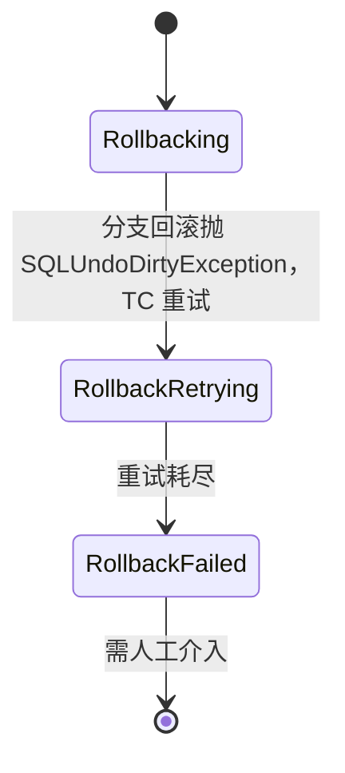

全局事务最终卡在 **`RollbackFailed`**，不会自动恢复——因为自动回滚不安全，必须人工处理。

日志会打出三份数据供定位：

```
Dirty data when undo.
  xid=..., branchId=...
  beforeImage={qty:100}
  afterImage ={qty:90}
  currentData={qty:80}     ← 对不上，问题在这
```

### 处理与规避

**默认原则：绝不自动强滚，人工确认后处理。**

1. 看日志三份镜像 → 定位表、行、被改成了什么；
2. 排查是谁改的：运维脚本？其他应用？其他事务模式？
3. 业务上判断最合理的补偿方式（**不是简单还原成前镜像**）；
4. 手动修复数据；
5. 清理现场 `undo_log` 与全局事务状态，让流程走完。

**能否直接 `validation=false` 硬滚？** 短期能让事务"走完"，但可能直接冲掉别人的正确修改，造成数据错乱。只适合"确认这些行没有被别的业务依赖"的场景，**不推荐**。

从源头规避：

| 措施 | 说明 |
| :--- | :--- |
| 业务写入统一走 Seata | 禁止运维/脚本/其他应用直接改被全局事务锁定的表 |
| 缩短全局事务持锁时间 | 别在全局事务里做远程调用、长计算、大批量更新 |
| 避开热点行 | 高并发扣减同一行易冲突，考虑拆分/分片 |
| 生产禁用 File 模式 | TC 重启丢锁 → 锁失效 → 更易脏写；集群用 DB 模式 |
| 慎用 `validation=false` | 关掉校验等于放弃最后一道防线 |
| 监控 `RollbackFailed` | 出现即告警，人工兜底 |

---

## 七、总结

AT 模式把标准 2PC 的"一阶段持锁"改造成"一阶段本地提交 + undo_log 补偿 + TC 全局锁"，用最终一致性换取了并发性能与低侵入性。五个内核机制可以这样串起来：

1. **全局锁**：`resourceId → table → pk → xid`，一阶段提交前申请，支撑写隔离并允许同 xid 重入；本地提交即释放物理行锁，但**全局锁要等二阶段结束才释放**；
2. **全局读隔离**：默认读未提交，要读已提交须用 `SELECT ... FOR UPDATE`（+ `@GlobalLock`）申请全局锁，让读者等到全局事务结束，且是**逐条 SQL** 的尽力而为；
3. **锁冲突重试**：抢不到全局锁时回滚本地事务、sleep、重执行整个本地事务，默认回滚以避免死锁，耗尽后抛 `LockConflictException` 并触发全局回滚；
4. **脏写校验**：回滚前用后镜像/前镜像双向比对当前数据，对不上即判定被第三方修改，抛 `SQLUndoDirtyException` 并让事务进入 `RollbackFailed` 交人工处理；
5. **全局锁的释放与残留**：正常随二阶段结束释放；超时则由 TC 定时任务触发 `TimeoutRollbacking` 回滚来释放，回滚失败进 `TimeoutRollbackRetrying` 持续重试，最终失败则锁**残留**。残留分两类——**回滚失败保守持锁**（设计内行为，需人工兜底）与**已提交却锁不释放**（并发竞态缺陷），症状相同、病因与处置不同。

**实践上最重要的一条**：把全局事务的持锁时间压到最短——**事务内无远程调用、无长耗时计算、无大批量更新**。绝大多数 AT 模式的线上问题，根因都在这里。
