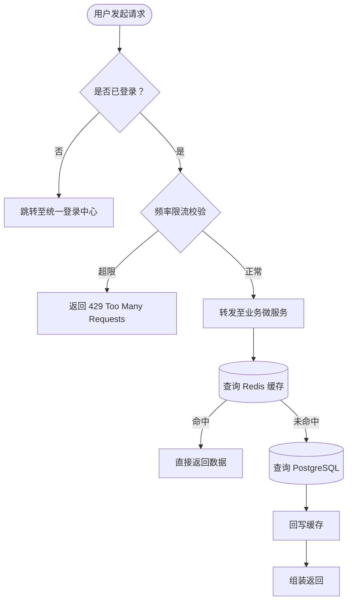
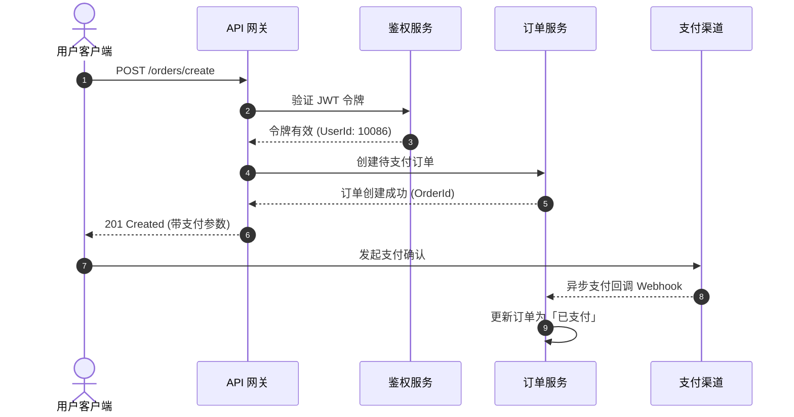

在撰写技术类文章时，清晰直观的图表往往比成段的文字更具穿透力。无论是算法分支、业务流转、接口时序，还是系统全景架构，都需要统一、美观且与站点风格融合的渲染支持。

我们在博客中采用了 **“代码文本绘图（Mermaid） + 复杂全景手绘图（Excalidraw SVG）”** 的组合方案。

---

## 一、业务流程图（Flowchart）

对于常规的业务逻辑分支、算法流程、状态判断，推荐直接使用 Markdown 中的 ```` ```mermaid ```` 代码块。

通过 `beautiful-mermaid` 渲染引擎，所有图表均在**构建期直接编译为内联 SVG**，不仅实现客户端 0kb JS 运行时代价，还原生自适应暗黑模式！



:::note
**特性提示**：点击图表右上角的「切换代码」按钮，可以随时展开并查看原始的 Mermaid 文本；点击「复制」按钮即可一键取走源码。
:::

---

## 二、微服务调用时序图（Sequence Diagram）

时序图能够清晰展示跨系统、跨进程之间的异步或同步消息传递过程：



---

## 三、复杂系统全景架构图（Excalidraw 矢量图）

当架构涉及多云部署、大量微服务集群、网络隔离边界或中间件拓扑时，文本代码自动排版容易出现混乱。此时推荐使用 [Excalidraw](https://excalidraw.com) 绘制，导出为内嵌源文件的 `.svg` 后引入：


### 为什么组合使用？

| 场景 | 推荐方案 | 核心优势 |
|---|---|---|
| **分支逻辑 / 算法流 / 业务链路** | **Mermaid** | 直接在 Markdown 中编写，版本 diff 清晰，改动成本极低 |
| **时序调用 / 状态机流转** | **Mermaid** | 结构化语法极易表达时序与状态跳转 |
| **大型微服务集群 / 基础设施拓扑** | **Excalidraw SVG** | 手绘风现代高级感，自由度高，支持源文件回拖二次编辑 |
