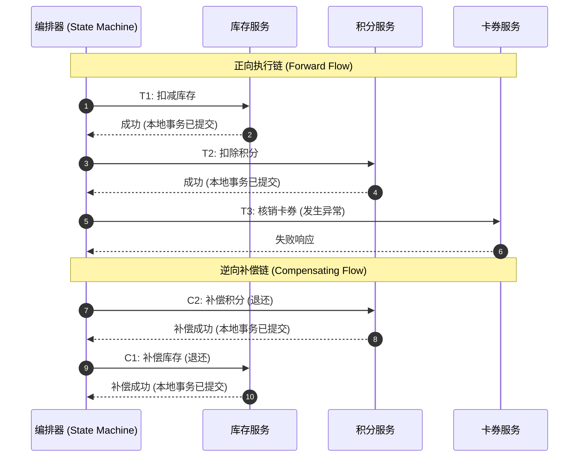
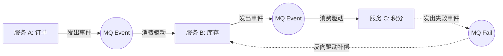
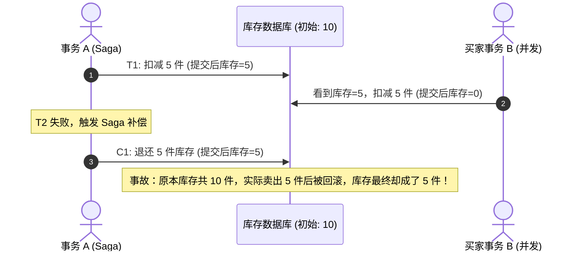

在分布式事务的探索中，我们依次分析了两种截然不同的思路：
- **2PC（两阶段提交）**：在数据库引擎层做协调，虽然保障了强一致性，但跨网络的物理锁长周期持有使系统吞吐量极低；
- **TCC（Try-Confirm-Cancel）**：将锁逻辑上移至应用层，通过预留资源实现高并发，但需要针对每个服务深度重构表结构并编写 Try、Confirm、Cancel 三个接口，改造成本极其高昂。

然而，在实际的生产架构中，我们经常会遇到两类业务困境：
1. **长调用链业务流**：例如电商下单，往往需要经过“扣减库存 $\to$ 扣减积分 $\to$ 核销卡券 $\to$ 扣减余额 $\to$ 创建订单 $\to$ 调用第三方物流通知”等五六个乃至十多个微服务；
2. **异构与第三方系统集成**：某些下游是遗留系统、银企直连通道或外部 SaaS，根本无法配合改造为 TCC 模式提供资源冻结与预留接口。

面对这种多服务、长流程、跨系统的业务场景，**Saga 模式**成为了业界的主流选择。

---

## 一、Saga 模式的核心设计思想

Saga 的思想最早由普林斯顿大学的 Hector Garcia-Molina 教授于 1987 年提出，其初衷是解决数据库长事务（Long-Lived Transactions, LLT）长期占用底层锁资源的问题。在微服务架构普及后，这一模式被广泛应用于跨服务长业务流的一致性保障。

### 1. 理论模型：短事务与补偿对

Saga 将一个长事务拆分为一系列由业务驱动的有序本地短事务：
- 每个正向短事务记作 $T_i$；
- 每个正向短事务都配有一个对应的**补偿事务（Compensating Transaction）**，记作 $C_i$。

其执行逻辑分为两个确定性分支：
- **顺利执行（Forward Flow）**：按照顺序依次执行 $T_1 \to T_2 \dots \to T_n$，全部成功则全局事务终结；
- **异常回滚（Compensating Flow）**：若在执行到第 $k$ 步（$T_k$）时发生业务失败或不可恢复的错误，系统将按照执行顺序的相反方向，逆向依次调用此前已经成功的正向事务的补偿操作：$C_{k-1} \to \dots \to C_2 \to C_1$。



### 2. Saga 与 TCC 的根本区别

许多初学者容易混淆 Saga 与 TCC，两者的根本区别在于**数据落地时机与隔离性设计**：

| 对比维度 | TCC 模式 | Saga 模式 |
| :--- | :--- | :--- |
| **第一阶段动作** | **仅预留资源**（如冻结金额），真实数据并未扣除 | **直接修改真实数据并提交本地事务** |
| **生效时机** | 第二阶段 Confirm 执行时正式生效 | 第一阶段 $T_i$ 执行后即时生效 |
| **失败处理机制** | Cancel 释放预留资源（逻辑解冻） | 调用补偿操作 $C_i$ 进行反向对冲（冲正） |
| **改造成本** | 极高（每个服务实现 3 个接口，重构表结构） | 较低（仅需提供正向执行和反向补偿 2 个接口） |
| **接入第三方能力** | 极差（外部系统极少提供预留接口） | 极好（只要外部系统提供反向冲正/退款 API 即可接入） |

---

## 二、协同式 vs 集中编排式：架构流派与工程选择

在微服务中落地 Saga，业界存在两种不同的架构设计流派：**事件协同式（Choreography）** 与 **集中编排式（Orchestration）**。

### 1. 事件协同式（Choreography）

在协同模式下，没有集中的调度中心。各个微服务之间通过消息队列（MQ）以“发布-订阅”的方式进行驱动：
1. 订单服务执行 $T_1$，发布 `OrderCreatedEvent`；
2. 库存服务监听该事件，执行本地短事务 $T_2$（扣库存），并发布 `InventoryDeductedEvent`；
3. 积分服务监听库存扣减事件，若积分扣减失败，发布 `PointsDeductFailedEvent`；
4. 库存服务监听失败事件，触发本地补偿 $C_1$ 退还库存。



- **优点**：组件去中心化，服务之间松耦合。
- **缺点（生产隐患）**：
  - **缺乏全局视图**：无法直观追踪一个长事务当前运行到哪个阶段；
  - **逻辑隐式依赖**：各个服务的事件订阅关系错综复杂，业务链路稍长就会形成“网状事件风暴”，极易出现死循环或漏消费；
  - **调试与测试极其困难**：跨服务的异步事件链难以端到端排查。

### 2. 集中编排式（Orchestration）

在集中编排模式下，引入一个**Saga 编排器（Orchestrator）/ 状态机引擎**作为中央大脑。编排器清楚地知晓整个流程的所有步骤、输入输出及补偿顺序。
编排器通过 RPC 或 HTTP 主动调用各个服务，收到响应后决定下一步推进方向或回滚。

- **优点**：
  - **集中可观测**：全局事务具有明确的状态机视图，停滞在哪个节点、失败原因一目了然；
  - **职责单一**：参与者微服务只需暴露业务操作与补偿操作，不关心谁在调用自己，消除循环依赖；
  - **易于拓展与维护**：新增或修改业务流程只需在编排器的状态机定义中增减节点，无需改动下游服务的事件监听。
- **缺点**：编排器自身需要具备高可用与持久化能力。

> **工程结论**：在涉及多微服务的复杂长事务中，**集中编排式（Orchestration）是工业界的事实标准**（如 Apache Seata Saga、AWS Step Functions、Temporal）。

---

## 三、缺乏隔离性（ACID 中的 I）引发的灾难与破局

Saga 模式最大的代价在于：**它彻底打破了 ACID 中的隔离性（Isolation）**。

由于正向子事务 $T_i$ 执行后立即提交了本地事务，一旦某个全局事务在后续步骤失败开始回滚，其已经提交的数据变更在这段“时间窗口”内是完全对外部暴露的。并发的其他全局事务或用户请求可能会读取到这些中间数据，引发**脏读（Dirty Read）**或**更新丢失（Lost Update）**。

### 1. 经典事故场景推演

假设存在库存数据：初始库存为 `10`。
有两个并发事务同时发生：
- **全局长事务 A**：购买 5 件商品，包含步骤 $T_1$（扣库存 5 件）和 $T_2$（扣减账户余额，后续将发生失败）；
- **常规买家事务 B**：并发购买 5 件商品。

时序推演如下：
1. **时刻 1**：事务 A 执行 $T_1$，扣减库存 5 件，**本地事务立即提交**，库存由 `10` 变为 `5`；
2. **时刻 2**：买家事务 B 到达，查询当前库存为 `5`，成功扣减 5 件并完成支付，库存由 `5` 变为 `0`；
3. **时刻 3**：事务 A 在 $T_2$ 阶段因账户余额不足抛出异常，Saga 编排器触发回滚，开始执行补偿事务 $C_1$（退还 5 件库存）；
4. **时刻 4**：$C_1$ 将库存加回 5 件，库存由 `0` 变为 `5`。



在这个案例中，事务 A 的中间修改被事务 B 覆盖读取，且事务 A 的补偿操作直接破坏了事务 B 已经生效的真实业务事实，引发了灾难性的数据错乱。

---

### 2. 隔离性工程破解方案

在不能依赖数据库行级锁的前提下，业界总结出以下几种保障数据安全的工程模式：

#### 方案一：语义锁（Semantic Lock）
- **核心思想**：在业务数据表增加显式状态标记（如 `status = PENDING`）。
- **执行规则**：
  1. 正向事务 $T_i$ 在修改数据时，将业务记录打上“锁定中”标记（例如将订单标记为 `CREATING`，将库存记录标记为 `UPDATING`）；
  2. 任何其他并发事务在读取或尝试更新该数据时，必须检查该状态标记。若发现处于中间态，则拒绝操作或等待；
  3. 全局事务最终成功或补偿完成后，由终结动作将标记重置。

#### 方案二：可交换性更新（Commutative Updates）
- **核心思想**：设计的操作在数学上必须满足交换律，使得操作到达的顺序不同也不会引发错误。
- **示例**：采用相对值增减（`UPDATE account SET balance = balance - 100`），而不是绝对值覆盖（`SET balance = :newBalance`）。
- **要求**：无论正向操作还是反向补偿，都必须针对相对差量执行，且底层字段不能突破边界（如防止扣成负数）。

#### 方案三：悲观视图隔离（Pessimistic View）
- **核心思想**：在对外展示的视图层，重构展示逻辑。
- **示例**：在长事务尚未全部成功结束前，前台用户只能看到“处理中”状态，相关的资产变更不计入可提现或可用额度，避免用户将未最终落地的资金提现转移。

---

## 四、补偿操作的“三大军规”

在编写 Saga 的补偿服务接口 $C_i$ 时，必须遵守以下三项铁律，否则系统会在重试风暴中陷入瘫痪：

### 1. 军规一：补偿操作必须支持幂等性（Idempotence）
编排器在触发补偿时，如果因网络抖动未收到下属服务的响应，会不断发起重试。补偿接口必须保证执行一次与执行多次的效果完全一致。

### 2. 军规二：防空补偿（Anti-Empty-Compensation）
由于网络丢包或超时，某个正向事务 $T_i$ 根本没有在服务节点上执行成功，编排器在全局回滚时向其下发了补偿指令 $C_i$。
- **防范机制**：补偿接口接收到请求后，必须首先查询本地是否存在对应的 $T_i$ 业务流水记录；若记录不存在，说明该操作从未执行过，**必须直接返回成功，绝不能执行反向冲正操作**。

### 3. 军规三：防悬挂（Anti-Suspension）
如果正向事务 $T_i$ 的请求在网络上严重滞后，导致编排器超时并先行触发了补偿 $C_i$（先执行了空补偿）。随后迟到的 $T_i$ 请求又到达了节点。
- **防范机制**：在执行空补偿时，在本地事务状态表中插入一条标记记录（如 `COMPENSATED`）。迟到的 $T_i$ 请求到达时，发现该事务已被标记为已补偿，**直接拒绝执行**，防止产生不可逆的业务悬挂。

> **核心法则**：**Saga 的补偿操作必须保证最终成功**。如果补偿操作因外部原因抛出异常，编排器绝不能尝试去“回滚补偿”，而必须无限次重试，或者记录告警事件由人工运维介入处理。

---

## 五、基于 Apache Seata Saga 状态机引擎实战

在 Apache Seata 中，Saga 模式基于**状态机引擎（State Machine Engine）**实现。开发人员可以通过可视化的 JSON DSL 流程文件来编排微服务调用。

### 1. 状态机 DSL 结构示例

以下是一个典型的库存扣减与补偿状态机定义片段：

```json
{
  "Name": "orderSagaWorkflow",
  "Comment": "电商下单长事务状态机",
  "StartState": "ReduceInventory",
  "Version": "1.0.0",
  "States": {
    "ReduceInventory": {
      "Type": "ServiceTask",
      "ServiceName": "inventoryService",
      "ServiceMethod": "reduce",
      "CompensateState": "CompensateInventory",
      "Next": "ReducePoints",
      "Catch": [
        {
          "Exceptions": ["java.lang.Throwable"],
          "Next": "CompensationTrigger"
        }
      ]
    },
    "CompensateInventory": {
      "Type": "ServiceTask",
      "ServiceName": "inventoryService",
      "ServiceMethod": "compensate"
    },
    "ReducePoints": {
      "Type": "ServiceTask",
      "ServiceName": "pointsService",
      "ServiceMethod": "reduce",
      "CompensateState": "CompensatePoints",
      "Next": "SuccessState"
    },
    "CompensatePoints": {
      "Type": "ServiceTask",
      "ServiceName": "pointsService",
      "ServiceMethod": "compensate"
    },
    "SuccessState": {
      "Type": "Succeed"
    },
    "CompensationTrigger": {
      "Type": "Compensation"
    }
  }
}
```

- `ServiceTask`：调用一个远程 RPC 服务方法；
- `CompensateState`：为当前正向方法显式绑定反向补偿方法；
- `Compensation`：触发状态机执行全局补偿流程。

---

### 2. 执行模式：向前重试 vs 向后回滚

Seata Saga 状态机提供了两种恢复策略：

1. **向后回滚（Backward Recovery）**：
   - 当遇到业务校验失败（例如余额不足、库存售罄）时，向前执行无意义，状态机反向依次执行所有已完成节点的补偿方法，将系统状态还原。
2. **向前重试（Forward Recovery）**：
   - 适用于**只许成功、不许失败**的确定性流程。例如用户付款已经成功扣除，后续的“生成发票”、“赠送优惠券”等操作，若发生临时网络抖动，不应回滚主流程，而是由状态机不断向前重试，直至节点最终调用成功。

---

## 六、分布式事务三大模式选型总结

至此，我们已经完整分析了 2PC、TCC 和 Saga 三大主流模式：

| 评估维度 | 2PC (XA 模式) | TCC 模式 | Saga 模式 |
| :--- | :--- | :--- | :--- |
| **一致性保障** | 强一致性（ACID） | 最终一致性（BASE） | 最终一致性（BASE） |
| **隔离性保障** | 具备（数据库锁级别） | 较好（通过业务资源预留隔离） | **较差（缺乏隔离性，需业务层防范）** |
| **并发吞吐能力** | 低（跨网络物理锁持有） | 高（本地短事务锁快速释放） | **极高（本地短事务直接提交）** |
| **业务侵入度** | **极低（数据源代理透明执行）** | 极高（需拆分 Try/Confirm/Cancel 3 接口） | 中等（只需正向操作与补偿操作 2 接口） |
| **长流程支持** | 极差（流程越长系统越脆弱） | 较差（调用链过长接口维护成本极高） | **极佳（专为长业务流与状态机而设计）** |
| **外部系统集成** | 不支持（外部系统无 XA 驱动） | 不支持（外部系统无预留接口） | **支持（外部系统提供冲正/退款 API 即可）** |

### 选型决策路径
- **追求零业务侵入、并发量可控、强一致敏感** $\to$ 选择 **2PC (Seata XA)**；
- **核心资金扣划、超高并发、具备明确资源预留维度** $\to$ 选择 **TCC 模式**；
- **跨越多服务的长业务链路、涉及第三方系统、对隔离性有业务容忍度** $\to$ 选择 **Saga 集中编排模式**。
