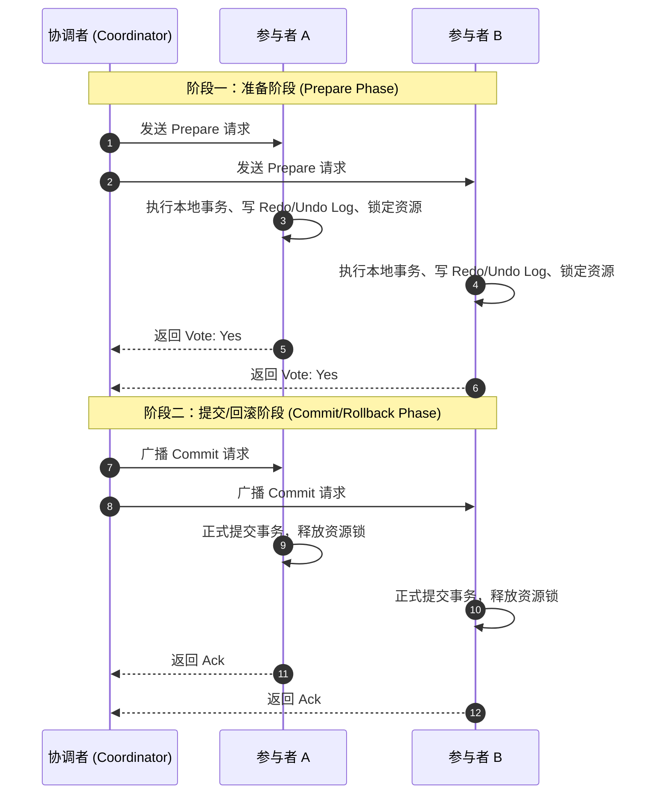
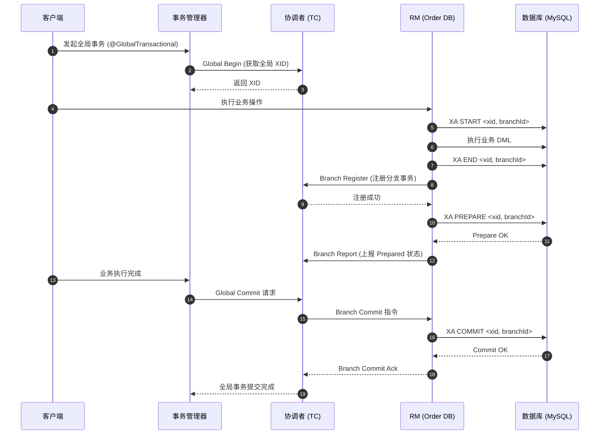
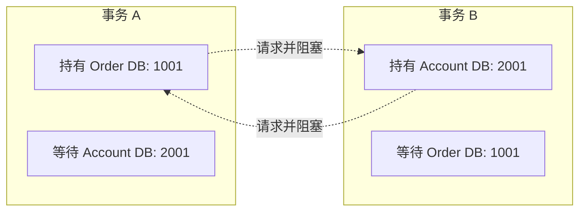
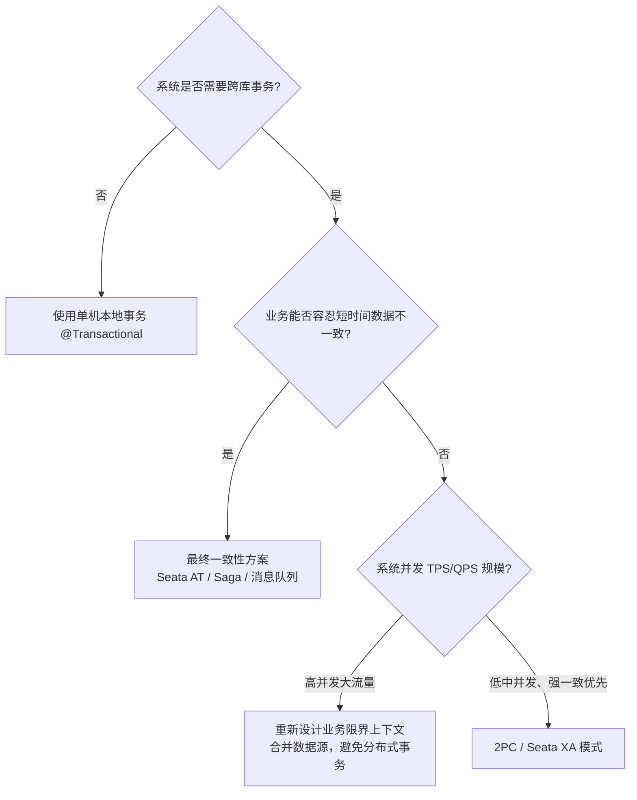

在单体系统向微服务架构演进或实施分库分表后，原本由关系型数据库单机事务（ACID）保障的数据一致性边界被打破。如何在跨网络、跨数据源的环境中保障事务一致性，是分布式系统设计必须面对的问题。

两阶段提交（Two-Phase Commit，简称 2PC）是解决此类问题最早且最经典的协议标准。本文将从 2PC 的理论模型切入，以开源分布式事务框架 Apache Seata 为工程载体，剖析其对 2PC 协议的实现机制，并梳理在生产落地过程中常见的故障场景与排查经验。

---

## 一、2PC 理论模型及其工程边界

### 1. 2PC 核心流程

2PC 协议定义了两个核心角色：
- **协调者（Coordinator）**：负责掌控全局事务的生命周期，收集各节点反馈并做出最终决议。
- **参与者（Participant）**：通常是各个独立的数据库节点或资源管理器（Resource Manager）。

整个事务提交流程分为两个阶段：



- **阶段一：准备阶段（Prepare / Voting Phase）**
  1. 协调者向所有参与者发送 `Prepare` 请求。
  2. 参与者在本地执行 SQL 操作，记录重做日志（Redo Log）和撤销日志（Undo Log），锁定相关数据行，但**不执行提交**。
  3. 各参与者向协调者反馈投票结果：若本地执行成功则回复 `Yes`，若失败或超时则回复 `No`。
- **阶段二：提交/回滚阶段（Commit / Rollback Phase）**
  1. 协调者汇总投票结果：
     - 若**所有**参与者均回复 `Yes`，协调者向所有参与者广播 `Commit` 指令；
     - 若**任一**参与者回复 `No` 或等待超时，协调者广播 `Rollback` 指令。
  2. 参与者接收指令后，完成本地事务的最终提交或回滚，释放锁定的资源，并向协调者回复确认（Ack）。

### 2. 2PC 的理论缺陷与工程代价

2PC 设计的核心目标是满足强一致性，但在不可靠的分布式网络环境下，它存在以下固有的缺陷：

1. **同步阻塞与锁生命周期过长**：
   参与者在完成 Phase 1 之后，必须持有数据行锁和数据库连接，直到 Phase 2 的决议下发。如果网络延迟增大或某一个参与者响应迟钝，所有参与者持有的锁都会被迫等待，导致整个系统的并发吞吐量剧烈下降。
2. **协调者单点故障（Single Point of Failure）**：
   如果协调者在 Phase 2 发送决议前发生宕机，所有已回复 `Yes` 的参与者都将处于“未决状态（In-Doubt）”。参与者无法单方面判定是该提交还是回滚，导致本地持有的数据锁长期悬挂。
3. **数据不一致死角（局部网络分区）**：
   若协调者在 Phase 2 向部分节点发送了 `Commit` 后发生网络分区或突发宕机，导致剩余参与者未收到指令，系统内部就会出现“部分节点已提交、部分节点未决”的数据分裂状态。

---

## 二、Seata 对 2PC 的工程实现剖析

在 Apache Seata 架构中，系统角色被抽象为三层：
- **TC（Transaction Coordinator）**：事务协调者，以独立的 Seata-Server 集群运行，维护全局事务和分支事务的状态。
- **TM（Transaction Manager）**：事务管理器，嵌入在业务发起方，负责开启、提交或回滚全局事务。
- **RM（Resource Manager）**：资源管理器，嵌入在各分支服务中，负责管理本地资源、注册分支事务并执行 TC 下达的提交或回滚指令。

针对 2PC，Seata 提供了两种具有代表性的模式：**严格遵循 XA 规范的 XA 模式**，以及**工程改良版的 AT 模式**。

### 1. Seata XA 模式：标准 2PC 的落地

Seata 的 XA 模式依托于关系型数据库（如 MySQL、PostgreSQL、Oracle）底层对 XA 规范的物理支持。

#### 驱动层代理机制
在 XA 模式下，应用配置的数据源被 Seata 的 `DataSourceProxyXA` 包装。业务代码无需关注底层 XA 细节，代理层在执行阶段与数据库通信：
- 在 Phase 1，向数据库发送 `XA START <xid>`、执行业务 SQL、`XA END <xid>`，最后执行 `XA PREPARE <xid>`，并将分支状态上报给 TC。
- 在 Phase 2，TC 决议完成后通知 RM，RM 重新获取连接并执行 `XA COMMIT <xid>` 或 `XA ROLLBACK <xid>`。



#### XA 模式的底层 SQL 表现
在 MySQL 中，`XA PREPARE` 阶段执行后，相关的修改操作已经写入 Redo Log 并持久化，相关数据行的行级锁（Record Lock / Next-Key Lock）在事务未终结前不会释放。

```sql
-- 阶段一由 RM 自动执行
XA START 'xid-order-001', 'branch-01';
UPDATE orders SET status = 'PAID' WHERE order_id = 1001;
XA END 'xid-order-001', 'branch-01';
XA PREPARE 'xid-order-001', 'branch-01';

-- 阶段二由 RM 收到 TC 调度后执行
XA COMMIT 'xid-order-001', 'branch-01';
```

---

### 2. 对比：Seata AT 模式对 2PC 锁机制的改良

为了解决标准 2PC / XA 模式中数据库物理锁持有周期长的问题，Seata 设计了 **AT（Automatic Transaction）模式**。两者核心对比如下：

| 对比维度 | XA 模式（标准 2PC） | AT 模式（改良 2PC） |
| :--- | :--- | :--- |
| **锁的持有者** | 数据库底层存储引擎（InnoDB 物理行锁） | Seata TC（逻辑全局锁 Global Lock） |
| **第一阶段行为** | `XA PREPARE`，**不提交**本地事务，持锁等待 | 解析 SQL 生成前/后镜像写入 `undo_log` 表，**直接本地 commit** |
| **第一阶段物理锁释放时机** | 直到第二阶段完成才释放 | 第一阶段本地提交后即释放物理锁 |
| **第二阶段行为** | 下发 `XA COMMIT` 或 `XA ROLLBACK` | Commit: 异步批量删除 `undo_log`；<br>Rollback: 根据 `undo_log` 反向补偿并提交 |
| **隔离性保障** | 读写强隔离（依据 DB 隔离级别） | 默认读未提交（Read Uncommitted）；若需防脏读需使用 `SELECT ... FOR UPDATE` 申请全局锁 |

**总结**：XA 是以牺牲并发性能为代价换取数据库层面的强隔离与简单性；AT 则通过在 Phase 1 提前释放物理锁来提升并发，但将隔离性与回滚逻辑转嫁到了应用程序和 Seata 框架维护的 Undo-log 与 Global Lock 上。

---

## 三、生产环境常见故障与排坑实践

### 1. 连接池枯竭与长事务锁级联阻塞

#### 故障现象
业务流量升高时，应用端报错：
```
java.sql.SQLTransientConnectionException: HikariPool-1 - Connection is not available, request timed out after 30000ms.
```
同时数据库监控显示活动线程数打满，出现大量的锁等待超时：
```
ERROR 1205 (HY000): Lock wait timeout exceeded; try restarting transaction
```

#### 原因分析
在 XA 模式下，从执行 `XA START` 到 `XA PREPARE` 期间，RM 必须独占一个物理数据库连接。若微服务链路较长（例如服务 A 调服务 B，服务 B 调服务 C），上游服务 A 的数据库连接在调用下游微服务的全部网络耗时期间都被强制占用，无法归还连接池。当网络产生抖动或下游响应变慢时，上游应用的连接池会在极短时间内被耗尽。

#### 排查与防范措施
1. **边界约束**：严格遵循“事务内无长耗时调用”原则。在 `@GlobalTransactional` 标记的方法范围内，严禁调用第三方 HTTP 接口、发送同步 MQ 消息或执行耗时计算。
2. **连接池与超时配置对齐**：
   - 数据库端的 `innodb_lock_wait_timeout`（默认通常为 50s）应与 Seata 的全局事务超时时间（`tx-service-group` 的 `timeout`）相匹配。
   - 避免全局事务超时时间大于数据库锁等待时间，防止数据库先抛出锁超时异常而全局事务仍在无效等待。

---

### 2. 协调者中断导致的 XA 事务悬挂（In-Doubt）

#### 故障现象
Seata TC 服务因宿主机宕机或网络分区发生异常重启后，业务恢复但某些特定数据行无法更新，一直处于锁等待状态。

#### 排查方法
登录涉及的数据库实例，查看是否存在处于 Prepared 状态但未提交的悬挂 XA 事务：

```sql
-- 查看所有处于 PREPARED 状态但未提交的 XA 分支
XA RECOVER;
```

输出样例：
```text
+----------+--------------+--------------+------------------+
| formatID | gtrid_length | bqual_length | data             |
+----------+--------------+--------------+------------------+
| 73656174 | 24           | 19           | 192.168.1.10:809...|
+----------+--------------+--------------+------------------+
```

可以通过 `INFORMATION_SCHEMA.INNODB_TRX` 查看这些事务持有的锁和线程状态：
```sql
SELECT trx_id, trx_state, trx_started, trx_query, trx_mysql_thread_id 
FROM information_schema.innodb_trx 
WHERE trx_state = 'PREPARED';
```

#### 恢复与处置策略
1. **Seata TC 自身的恢复机制**：
   - Seata TC 的高可用依赖其存储模式（`store.mode`）。生产环境禁止使用内存模式（`file`），必须配置为基于数据库（`db`）或基于 Raft 协议集群（`raft`）。
   - TC 重启后，会扫描存储介质中状态为 `Committing` 或 `Rollbacking` 的全局事务，并重新调度 RM 执行对应的 Phase 2 指令。
2. **人工应急干预**：
   若 TC 存储损坏或某些历史测试产生的脏 XA 事务长期无法自动清除，DBA 可根据业务日志判定后，手动终止该事务释放锁：
   ```sql
   -- 手动提交指定 xid 的事务
   XA COMMIT X'formatID', X'gtrid', X'bqual';

   -- 或手动回滚
   XA ROLLBACK X'formatID', X'gtrid', X'bqual';
   ```

---

### 3. MySQL 权限与版本兼容性陷阱

#### 坑点一：MySQL 8.0 的 `XA_RECOVER_ADMIN` 权限缺失
- **现象**：在升级至 MySQL 8.0 之后，Seata RM 在启动分支恢复或执行状态回查时频繁抛出异常：
  ```
  java.sql.SQLException: Access denied; you need (at least one of) the XA_RECOVER_ADMIN privilege(s) for this operation
  ```
- **原因**：从 MySQL 8.0 开始，官方增强了对 XA 事务的安全控制，执行 `XA RECOVER` 命令必须显式赋予 `XA_RECOVER_ADMIN` 权限。
- **解决办法**：为应用数据库连接账号授权：
  ```sql
  GRANT XA_RECOVER_ADMIN ON *.* TO 'app_user'@'%';
  FLUSH PRIVILEGES;
  ```

#### 坑点二：历史版本 MySQL 5.7 XA 与 Binlog 同步缺陷
- **问题背景**：在早期 MySQL 5.7 小版本（如 5.7.7 之前），当参与者实例发生 Crash-Safe 崩溃恢复时，`XA PREPARE` 的状态虽然写入了 InnoDB Redo Log，但在某些边缘场景下尚未刷入 Binlog。如果主库崩溃并发生主从切换，从库可能缺少该事务的分支信息，导致主从数据不一致。
- **配置建议**：生产环境务必确保：
  ```ini
  # 确保双一配置
  sync_binlog = 1
  innodb_flush_log_at_trx_commit = 1
  ```
  且尽可能采用 MySQL 8.0 最新长期支持（LTS）版本。

---

### 4. 跨分支事务的分布式死锁

#### 故障现象
单库环境下的死锁通常能够被 InnoDB Deadlock Detector 快速检测（通常在毫秒级内自动回滚开销较小的一个事务）。但在跨服务的分布式事务中，死锁可能横跨多个物理数据库实例。

#### 死锁场景推导
假设业务流程中有两个并发请求操作跨库的资源：
- **全局事务 A**：先在 Order DB 锁定订单 1001，随后在 Account DB 尝试锁定账户 2001。
- **全局事务 B**：先在 Account DB 锁定账户 2001，随后在 Order DB 尝试锁定订单 1001。



由于两个物理数据库之间的死锁检测机制互不连通，InnoDB 无法判定这是死锁，只能等待各自分支的锁超时（`innodb_lock_wait_timeout`），最终导致相关接口的 P99 延迟急剧恶化。

#### 规避规范
1. **全局统一资源访问顺序**：
   在架构设计规范中明确定义跨数据源访问的先后顺序（例如严格遵循：先订单库、后账户库、再库存库），消除交叉竞争锁的条件。
2. **悲观锁改乐观锁**：
   对于冲突频繁但非核心的计数器场景，采用带版本号的乐观更新（`UPDATE ... SET version = version + 1 WHERE id = ... AND version = old_version`），避免长时间持有物理行锁。

---

## 四、方案选型与落地权衡

在选择是否使用 2PC（包括 Seata XA 模式）时，应从以下维度进行综合评估：



1. **适合采用 2PC / Seata XA 的场景**：
   - 核心交易、账务结算、计费对账等对一致性要求严苛、绝对不允许出现脏读或中间状态的场景；
   - 系统并发量较低或中等，业务链路短，数据库主要处于局域网稳定网络内。
2. **不建议采用 2PC 的场景**：
   - 高并发、大促等对系统高可用和吞吐量有硬性要求的互联网业务；
   - 链路跨越多个层级或涉及异构外部系统的长业务流。这类场景应优先考虑 Seata AT 模式、Saga 编排或可靠消息最终一致性方案。
