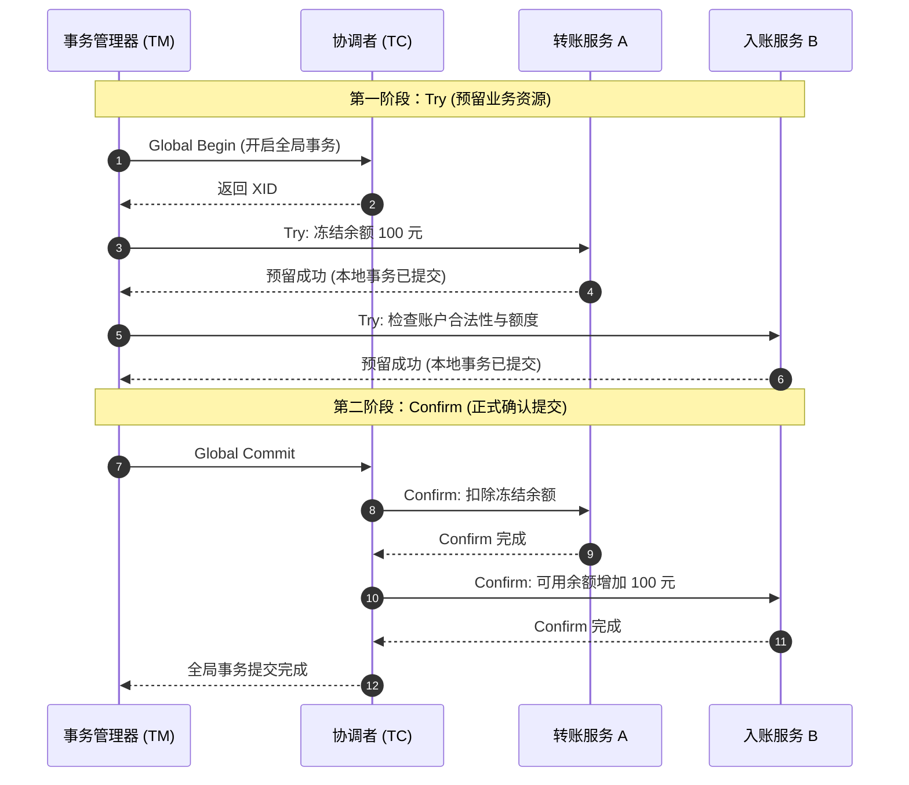
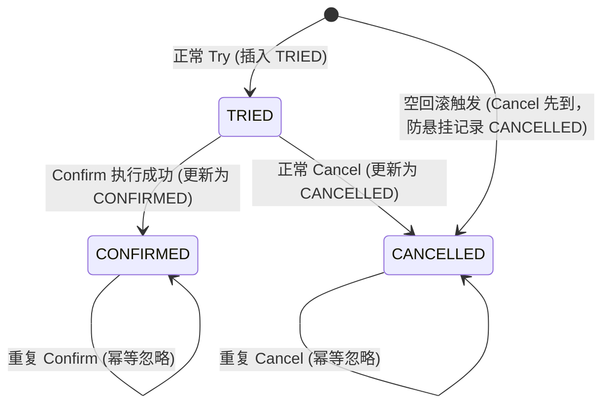

在探讨 2PC（两阶段提交）时，我们分析了其根本性的工程痛点：**数据库物理行锁跨越网络调用被长时间持有**，在并发流量下极易引发连接池枯竭与级联阻塞。

为了在分布式环境下兼顾高吞吐与数据一致性，业界提出了将“事务两阶段提交”从数据库物理层上移至应用代码层的解决方案 —— **TCC（Try-Confirm-Cancel）模式**。

本文将从 TCC 的设计原语出发，以 Apache Seata 的 TCC 模式为载体，推导其资源预留模型，并深入剖析生产落地中最棘手的“空回滚、业务悬挂、幂等”三大经典异常与应对方案。

---

## 一、从底层物理锁到应用层逻辑锁：为什么需要 TCC？

### 1. 2PC 的性能瓶颈根源

在 2PC / XA 模式中，第一阶段（`XA PREPARE`）执行后，数据库引擎会持有相关数据行的排他锁（X 锁），并且持有当前物理数据库连接。这一锁状态必须持续到第二阶段（`XA COMMIT` / `XA ROLLBACK`）指令到达才被释放。

在跨微服务调用链路中，网络的往返时延（RTT）、下游处理延迟都会被成倍放大为数据库行锁的持有时间。高并发环境下，同一热点账户或商品的更新会导致大量事务排队等待，严重制约系统的整体 TPS。

### 2. TCC 的核心破局点

TCC 将两阶段提交的控制权交给了业务逻辑：
- **第一阶段（Try）**：不直接修改最终数据，而是通过业务手段**预留/冻结业务资源**。Try 阶段的本地 SQL 执行完毕后，**立即提交本地事务并释放物理行锁和连接**。
- **第二阶段（Confirm / Cancel）**：根据全局决议，使用预留的资源完成实际业务变更（Confirm），或退还预留的资源（Cancel）。两个分支同样是快速执行的本地短事务。

通过这种“**业务逻辑锁 / 资源预留**”替代“**数据库底层物理锁**”的方式，数据库连接得以迅速归还连接池，从根本上消除了长周期同步阻塞。

---

## 二、TCC 生命周期与 Seata 工程落地

### 1. 资源预留模型（以账户扣减为例）

以经典的跨服务资金转账或扣款为例，为了实现资源预留，通常需要在业务数据表中设计两类字段：**可用余额** 与 **冻结余额**。

```sql
CREATE TABLE account (
    user_id           BIGINT PRIMARY KEY,
    available_balance DECIMAL(12, 2) NOT NULL DEFAULT 0.00, -- 可用余额
    frozen_balance    DECIMAL(12, 2) NOT NULL DEFAULT 0.00  -- 冻结余额
);
```

#### 三阶段对应的 SQL 逻辑

- **Try 阶段（冻结资金）**：
  ```sql
  -- 校验并冻结可用余额，立即提交
  UPDATE account 
  SET available_balance = available_balance - 100.00,
      frozen_balance    = frozen_balance + 100.00
  WHERE user_id = 1001 AND available_balance >= 100.00;
  ```
- **Confirm 阶段（正式划扣）**：
  ```sql
  -- 扣减之前预留的冻结金额，立即提交
  UPDATE account 
  SET frozen_balance = frozen_balance - 100.00
  WHERE user_id = 1001 AND frozen_balance >= 100.00;
  ```
- **Cancel 阶段（解冻退还）**：
  ```sql
  -- 将冻结金额退回可用余额，立即提交
  UPDATE account 
  SET available_balance = available_balance + 100.00,
      frozen_balance    = frozen_balance - 100.00
  WHERE user_id = 1001 AND frozen_balance >= 100.00;
  ```

---

### 2. Apache Seata TCC 接口定义

在 Apache Seata 中，TCC 参与者通过定义两阶段业务接口来声明：

```java
@LocalTCC
public interface AccountTccService {

    /**
     * 第一阶段：Try 方法
     * 定义两阶段动作名称，并指定 Confirm 和 Cancel 方法名
     */
    @TwoPhaseBusinessAction(
        name = "prepareDeductAccount", 
        commitMethod = "confirmDeduct", 
        rollbackMethod = "cancelDeduct"
    )
    boolean prepareDeduct(
        BusinessActionContext context,
        @BusinessActionContextParameter(paramName = "userId") Long userId,
        @BusinessActionContextParameter(paramName = "amount") BigDecimal amount
    );

    /**
     * 第二阶段：Confirm 确认方法
     */
    boolean confirmDeduct(BusinessActionContext context);

    /**
     * 第二阶段：Cancel 取消方法
     */
    boolean cancelDeduct(BusinessActionContext context);
}
```

- `@LocalTCC`：标记该接口在本地由 Spring 容器管理，支持代理拦截；
- `@TwoPhaseBusinessAction`：将当前方法定义为 Try 动作，并关联 Phase 2 对应的 Confirm 与 Cancel 实现；
- `BusinessActionContext`：上下文对象，用于将 Try 阶段传入的业务参数（如 `userId`、`amount`）传递给 Phase 2。

---

### 3. 正常与异常交互时序



如果在 Try 阶段，服务 B 发生业务校验失败（如账户已被风控冻结）或网络超时：
1. TM 捕获异常向 TC 发起 `Global Rollback`；
2. TC 调度各分支服务的 `Cancel` 接口；
3. 服务 A 执行 `cancelDeduct` 解冻资金，系统状态安全回滚。

---

## 三、生产级防坑攻防：空回滚、业务悬挂与幂等的统一解法

TCC 模式在逻辑上优雅，但在不可靠的分布式网络环境下，它被称为“实现成本最高”的分布式事务方案。原因在于网络丢包、延迟与重试机制会导致以下三大典型异常边界：

### 1. 三大经典异常定义

1. **空回滚（Empty Rollback）**：
   - **成因**：由于网络闪断或丢包，参与者的 `Try` 请求根本没有到达服务端，或者在发起前就抛出了超时异常。协调者（TC）判定该全局事务失败，向该参与者发送了 `Cancel` 请求。
   - **危害**：参与者尚未执行 `Try`（未冻结金额），却直接执行了 `Cancel`（解冻并增加可用余额）。如果不加校验，将导致资金无故增加，产生数据错误。
2. **业务悬挂（Suspension）**：
   - **成因**：网络严重拥堵，协调者发出的 `Try` 请求严重超时未达。协调者触发回滚并向参与者发送 `Cancel` 指令。由于网络抖动，`Cancel` 先于迟滞的 `Try` 到达并执行完毕。随后，那个原本超时的 `Try` 请求居然再次到达参与者并被执行。
   - **危害**：此时全局事务早已终结，参与者在执行迟到的 `Try` 时冻结了资金，但后续再也不会有新的 `Cancel` 来释放它。这笔资金将永久处于冻结状态，形成“业务悬挂”。
3. **幂等性失效（Idempotence）**：
   - **成因**：TC 在下发 `Confirm` 或 `Cancel` 时，如果遇到网络短暂抖动未收到 Ack，会按照重试策略反复调用。
   - **危害**：若接口未做幂等控制，重复的 Confirm 可能导致资金被重复划扣，重复的 Cancel 可能导致资金被重复解冻退回。

---

### 2. 状态机与控制表设计（一表破三坑）

为了彻底解决上述三大问题，业界最成熟且行之有效的方案是引入一张 **TCC 事务控制记录表**。每一个参与者的本地业务库中都维护一张该表，且对该表的操作与业务操作处于**同一个本地事务**内。

#### 事务控制表结构
```sql
CREATE TABLE tcc_transaction_record (
    xid           VARCHAR(128) NOT NULL, -- 全局事务 ID
    branch_id     BIGINT NOT NULL,       -- 分支事务 ID
    status        TINYINT NOT NULL,      -- 状态: 1-TRIED, 2-CONFIRMED, 3-CANCELLED
    gmt_create    DATETIME NOT NULL,
    PRIMARY KEY (xid, branch_id)
);
```

#### 状态流转规则



---

### 3. 三阶段防御代码实现逻辑

#### 阶段一：Try 逻辑（防御悬挂）
```java
@Transactional(rollbackFor = Exception.class)
public boolean prepareDeduct(BusinessActionContext context, Long userId, BigDecimal amount) {
    String xid = context.getXid();
    long branchId = context.getBranchId();

    // 1. 检查控制表记录
    TccRecord record = tccRecordMapper.select(xid, branchId);
    
    // 防悬挂判定：若记录已存在且为 CANCELLED，说明 Cancel 先到了，绝不能再执行 Try
    if (record != null && record.getStatus() == Status.CANCELLED) {
        log.warn("检测到业务悬挂请求，xid: {}, branchId: {}，拒绝执行", xid, branchId);
        return false;
    }

    // 2. 执行业务层资金冻结
    int updated = accountMapper.freezeBalance(userId, amount);
    if (updated == 0) {
        throw new BusinessException("可用余额不足，冻结失败");
    }

    // 3. 插入控制记录，状态标记为 TRIED
    tccRecordMapper.insert(new TccRecord(xid, branchId, Status.TRIED));
    return true;
}
```

#### 阶段二：Confirm 逻辑（保障幂等）
```java
@Transactional(rollbackFor = Exception.class)
public boolean confirmDeduct(BusinessActionContext context) {
    String xid = context.getXid();
    long branchId = context.getBranchId();

    TccRecord record = tccRecordMapper.select(xid, branchId);
    if (record == null) {
        log.error("未找到对应 Try 记录，数据异常，xid: {}", xid);
        return false;
    }

    // 幂等处理：若已被 Confirm 过，直接返回成功
    if (record.getStatus() == Status.CONFIRMED) {
        return true;
    }

    // 1. 正式扣除冻结余额
    Long userId = (Long) context.getActionContext("userId");
    BigDecimal amount = (BigDecimal) context.getActionContext("amount");
    accountMapper.deductFrozenBalance(userId, amount);

    // 2. 更新控制表状态为 CONFIRMED
    tccRecordMapper.updateStatus(xid, branchId, Status.CONFIRMED);
    return true;
}
```

#### 阶段三：Cancel 逻辑（防空回滚与幂等）
```java
@Transactional(rollbackFor = Exception.class)
public boolean cancelDeduct(BusinessActionContext context) {
    String xid = context.getXid();
    long branchId = context.getBranchId();

    TccRecord record = tccRecordMapper.select(xid, branchId);

    // 防空回滚与防悬挂核心逻辑：
    if (record == null) {
        // Try 未执行过，发生空回滚。插入 CANCELLED 记录防悬挂，但不执行解冻业务
        log.info("触发空回滚，防悬挂标记落库，xid: {}", xid);
        tccRecordMapper.insert(new TccRecord(xid, branchId, Status.CANCELLED));
        return true;
    }

    // 幂等处理：若已被 Cancel 过，直接返回成功
    if (record.getStatus() == Status.CANCELLED) {
        return true;
    }

    // 1. 正常回滚：退还冻结金额至可用余额
    Long userId = (Long) context.getActionContext("userId");
    BigDecimal amount = (BigDecimal) context.getActionContext("amount");
    accountMapper.unfreezeBalance(userId, amount);

    // 2. 更新控制表状态为 CANCELLED
    tccRecordMapper.updateStatus(xid, branchId, Status.CANCELLED);
    return true;
}
```

---

## 四、方案选型与工程权衡

TCC 在性能和隔离性之间做出了极佳的平衡，但并非没有代价。

| 评估维度 | 2PC (XA 模式) | TCC 模式 |
| :--- | :--- | :--- |
| **性能吞吐 (TPS)** | 低（物理行锁长周期跨网持有） | 极高（仅本地短事务锁，快速释放） |
| **业务侵入度** | 极低（框架代理，业务代码无感知） | 极高（业务层重构表结构，拆分 3 个接口） |
| **异常控制成本** | 低（由 DB 引擎和底层驱动保障） | 高（必须自行处理空回滚、悬挂、幂等） |
| **隔离性保障** | 强一致（无脏读、不可重复读） | 最终一致（Try 阶段数据中间态对用户可见） |

### 适用与避坑场景建议

1. **推荐采用 TCC 的场景**：
   - 核心计费、资金扣划、高频库存预占等对吞吐量和一致性有双重苛刻要求的核心链路；
   - 业务模型天然支持“中间态/预留态”（例如：余额有“可用与冻结”、库存有“可用与锁定”、座位有“待支付与已售”）。
2. **不建议采用 TCC 的场景**：
   - 传统企业级信息管理系统、CRUD 密集型应用；
   - 调用链过长（超过 5 级微服务）的通用业务流程（接口维护成本与异常分支爆炸）；
   - 缺少资源预留维度的业务（例如单纯的更新配置、更新用户信息，很难拆解 Try 与 Cancel 语义）。
