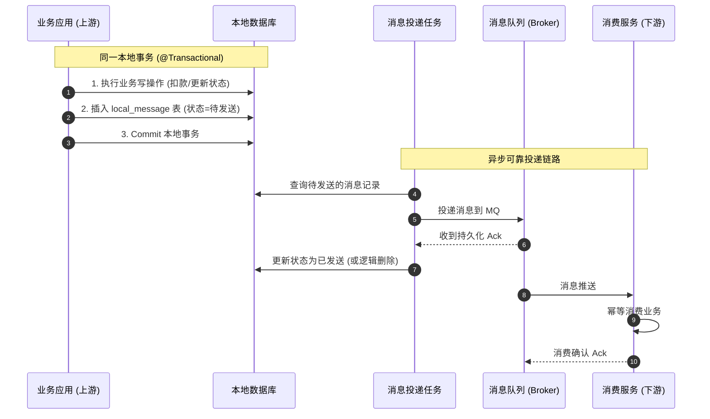
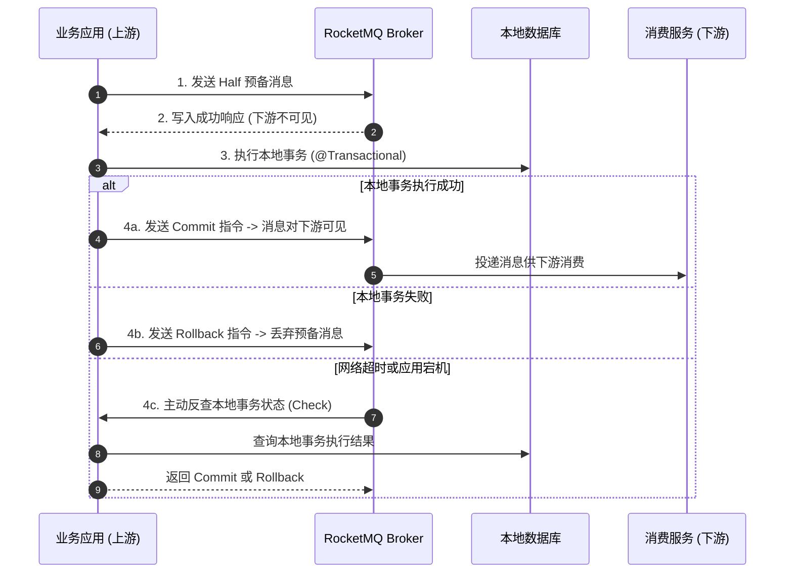

在探讨 2PC、TCC 与 Saga 时，我们面对的都是“**双向带有回滚机制**”的分布式事务模型：上游必须感知下游各参与者的成败，一旦出错需要协调大家一同回滚或逆向补偿。

然而在互联网高并发架构中，绝大多数业务场景本质上是“**单向推进、只许成功**”的：
- **电商交易**：买家支付成功后，需要执行“增加积分”、“赠送优惠券”、“发送发票”、“通知履约仓储”；
- **用户体系**：新用户注册成功后，需要执行“发放新手大礼包”、“推送欢迎通知”。

这些下游操作不属于核心计费闭环，没有必要与上游主事务进行同步强绑定。只要上游核心业务成功，下游动作在随后的几秒或几分钟内最终达成一致即可。

为了换取极致的吞吐量与完全解耦的架构，**基于可靠消息的最终一致性方案**成为了高并发分布式系统中使用最广泛的落地策略。

---

## 一、异步解耦的代价：为什么“本地事务 + 发送 MQ”不是原子的？

许多刚接触分布式架构的开发者，往往会写出类似下面的伪代码：

```java
@Transactional
public void completePayment(String orderId) {
    // 1. 本地数据库操作：修改订单状态为已支付
    orderMapper.updateStatus(orderId, OrderStatus.PAID);

    // 2. 发送 MQ 消息通知下游微服务
    mqProducer.send("order_paid_topic", new OrderPaidEvent(orderId));
}
```

这段代码看似简单顺畅，但在不可靠的分布式网络环境下，存在致命的**原子性断裂**隐患：

### 1. 经典死角与资损推导

1. **先写库，后发消息**：
   - 假设本地事务执行成功并 `commit`。随后代码调用 `mqProducer.send(...)`，此时若遇到网络抖动、MQ 集群闪断或应用服务器突发 OOM 重启，消息未能投递出去。
   - **后果**：钱已扣，订单已置为已支付，但下游的积分、卡券、物流履约永远无法被触发，造成严重客诉。
2. **先发消息，后写库**：
   - 假设先向 MQ 发送消息成功，随后执行数据库更新。此时数据库发生唯一键冲突、死锁回滚或连接池中断。
   - **后果**：本地事务回滚，钱根本没扣成功；但下游系统已经从 MQ 拉取到了消息并完成了赠送与发货，造成**直接的资损事故**。
3. **在 `@Transactional` 事务内发消息**：
   - 即使发消息放在事务边界内，`mqProducer.send` 是跨网络的 I/O 阻塞调用，这会大幅拉长数据库事务与连接的持有时间；
   - 更严重的是：如果消息发送成功，但在方法即将退出、Spring 准备提交数据库连接时抛出了异常（如连接失效或持久化失败），数据库将执行回滚，而 MQ 消息却已被推送给了下游，导致下游消费了本该回滚的“幽灵数据”。

**核心矛盾**：**“单机数据库事务”与“跨网络发送 MQ 消息”是两个分属不同物理介质的独立动作，天然无法自动获得原子性保障。**

---

## 二、通用经典解法：本地消息表（Local Message Table）

本地消息表方案最早由 eBay 架构师提出，其精髓在于：**利用本地关系型数据库天然具备的 ACID 强一致性，将“业务变更”与“消息记录”捆绑在同一个本地事务内提交。**

该方案最大的优势是**对消息中间件没有任何特殊功能要求**，无论是 Kafka、RabbitMQ 还是普通的消息队列均可适配。

### 1. 核心流程与数据表设计

在本地业务数据库中，增加一张专门的本地消息表：

```sql
CREATE TABLE local_message (
    id            VARCHAR(64) PRIMARY KEY, -- 消息全局唯一ID (如 UUID / 分布式ID)
    topic         VARCHAR(128) NOT NULL,   -- 目标 MQ 主题
    payload       JSON NOT NULL,           -- 消息体数据
    status        TINYINT NOT NULL,        -- 状态: 0-待发送, 1-已发送, 2-发送失败
    retry_count   INT NOT NULL DEFAULT 0,  -- 重试次数
    next_retry    DATETIME NOT NULL,       -- 下次重试时间
    gmt_create    DATETIME NOT NULL,
    gmt_modified  DATETIME NOT NULL
);
```

#### 完整处理时序



1. **原子写入**：业务操作（如更新订单）与向 `local_message` 插入一条记录在同一个事务内提交。只要本地事务成功，消息记录必定持久化落库；若业务失败回滚，消息记录同样回滚消失。
2. **可靠发送**：后台投递引擎扫描状态为“待发送”的记录，将消息投递至 MQ，在收到 MQ 的确认响应（Ack）后，将记录状态更新为“已发送”。

### 2. 投递引擎的实现对比：定时扫表 vs Binlog CDC

在实现后台消息投递时，工业界有两种常见模式：

| 对比维度 | 模式一：定时任务轮询扫表 (Poller) | 模式二：基于 Binlog CDC 监听 (Canal / Debezium) |
| :--- | :--- | :--- |
| **工作机制** | 定时任务（如 XXL-Job、Scheduled）分页查询 `local_message` 表 | 监听数据库底层 Binlog 日志，流式解析出新增消息行 |
| **实时性** | 存在轮询时间间隔（如 1~3 秒延迟） | 亚秒级实时（毫秒级感知） |
| **数据库压力** | 高并发下频繁 `SELECT ... FOR UPDATE` 产生物理读压力与锁争用 | **零额外数据库查询压力**（纯读取 Binlog 二进制流） |
| **架构复杂度** | 简单，无额外中间件依赖 | 需部署 Canal/Debezium 及对应监听集群，运维成本较高 |
| **适用场景** | 中小流量、对秒级延迟不敏感的场景 | 超高并发、追求极致低延迟与数据库零侵扰的大型系统 |

---

## 三、云原生高性能解法：RocketMQ 事务消息

如果系统引入了 **Apache RocketMQ**，则无需在本地额外建表和维护后台扫表任务。RocketMQ 原生提供了**事务消息（Transactional Message）**能力，将 2PC 的思想直接映射到了消息中间件的底层实现中。

### 1. 核心流程时序



### 2. 底层运行机制深度剖析

#### 机制一：半消息（Half Message）为什么下游看不到？
当生产者向 RocketMQ 发送半消息时，Broker 内部并不是把消息投递到目标 Topic（如 `order_paid_topic`），而是**对消息 Topic 和 Queue 进行内部替换**：
- 真实 Topic 会被暂存在消息的属性属性（Properties）中；
- 消息实际被写入了内置的系统主题：`RMQ_SYS_TRANS_HALF_TOPIC`。

因为下游消费者只订阅了 `order_paid_topic`，根本不会去监听半消息队列，所以在第一阶段，**下游消费者完全不可见这笔预备消息**。

#### 机制二：决议下发与 Topic 还原
- **Commit**：当应用本地事务成功并发送 Commit 决议后，Broker 会从 `RMQ_SYS_TRANS_HALF_TOPIC` 读取该消息，将 Topic 还原为原本的 `order_paid_topic` 并重新写入 CommitLog，此时下游消费者正式拉取并消费该消息；
- **Rollback**：Broker 直接将半消息标记为废弃（写入 `RMQ_SYS_TRANS_OP_HALF_TOPIC` 记录该消息已被处理），下游永远不会收到该消息。

#### 机制三：事务状态反查（Transaction Check）自愈闭环
若应用执行完本地事务后突发宕机，或者最后发送 Commit 指令的网络发生了中断，Broker 会启动后台定时扫描线程，针对超过一定时间未收到决议的半消息，**主动向生产者集群发起状态反查请求**。
应用端只需实现 `RocketMQLocalTransactionListener` 中的 `checkLocalTransaction` 方法，通过查询本地数据库该业务记录是否存在，即可精准向 Broker 告知当前是应该 Commit 还是 Rollback，实现了分布式异常下的完美自愈。

---

## 四、消费端的“三大护法”（生产排坑实战）

基于消息的分布式方案，上游通过机制保证了“消息必定投递成功”，但数据一致性的最终落成，完全依赖于**下游消费端**的稳健性。在分布式环境下，消费端必须筑牢以下三大防线：

### 1. 绝对幂等性保障（At-least-once 交付）

消息队列在网络通信层面遵循的是“**至少投递一次（At-least-once）**”原则。网络抖动、消费超时导致的自动重试都会导致下游收到**完全相同的重复消息**。如果下游未做幂等控制，重复消费将直接引发多赠送积分、多扣库存等资损事件。

#### 生产级双层防重设计
```sql
-- 消费端防重记录表
CREATE TABLE consumer_idempotent_record (
    biz_key     VARCHAR(128) PRIMARY KEY, -- 业务唯一键 (如 order_id + biz_type)
    msg_id      VARCHAR(64) NOT NULL,
    gmt_create  DATETIME NOT NULL
);
```

```mermaid
flowchart TD
    Recv[收到 MQ 消息] --> Step1{Redis 快速预检<br>SETNX biz_key}
    Step1 -->|已存在 (重复)| Ack[直接返回消费成功 Ack]
    Step1 -->|成功抢占| Step2[开启本地事务]
    Step2 --> Step3[插入 consumer_idempotent_record]
    Step3 --> Step4[执行核心下游业务更新]
    Step4 --> Step5[Commit 本地事务]
    Step5 --> Ack
```

1. **第一层（Redis 拦截）**：利用 Redis 的 `SET biz_key 1 EX 300 NX` 进行轻量级快速拦截，过滤掉绝大多数瞬间涌入的并发重复消息；
2. **第二层（数据库唯一约束兜底）**：将业务更新与向 `consumer_idempotent_record` 防重表插入记录放在同一个本地事务内。依靠数据库的主键唯一约束彻底杜绝脏写入。

---

### 2. 死信队列（DLQ）与兜底补单机制

若下游消费业务因代码逻辑缺陷（如 `NullPointerException`）或脏数据导致消费反复失败，MQ 会依据重试策略（如 RocketMQ 默认间隔递增重试 16 次）进行反复重投。
- 如果重试达到上限依然失败，消息会被投递至**死信队列（Dead Letter Queue, DLQ）**；
- 此时下游服务不能无感知！必须配置针对死信队列的**监控与告警指标**；
- 建立运营对账与补单机制：通过管理后台查看死信消息的 Payload，在修复 Bug 或数据后，支持人工一键重放消息。

---

### 3. 消息乱序与状态机跃迁控制

在网络并发或重试场景下，不同业务消息到达的顺序可能会发生倒置。
- **典型乱序事故**：上游快速连续发出了 `订单创建` 消息与 `订单取消` 消息。由于网络波动，下游先收到了 `订单取消`，后收到了 `订单创建`。
- **防范法则（业务状态机单向跃迁）**：
  下游在执行业务状态变更时，严禁使用盲目的绝对值更新，必须基于状态机的前置条件进行更新：
  ```sql
  -- 只有当前状态为 PAID 时，才允许变更为 COMPLETED
  UPDATE orders 
  SET status = 'COMPLETED' 
  WHERE order_id = 1001 AND status = 'PAID';
  ```
  若受影响行数为 0，说明发生乱序或前置状态不满足，应根据业务规则判定是丢弃消息还是记录日志告警。

---

## 五、四大分布式事务方案全景选型指南

至此，分布式事务知识体系中的四种主流方案已全部梳理完毕。以下是各维度的横向全景对比：

| 评估维度 | 2PC (XA 模式) | TCC 模式 | Saga 模式 | 基于 MQ 可靠消息 |
| :--- | :--- | :--- | :--- | :--- |
| **一致性级别** | 强一致性 (ACID) | 最终一致性 (BASE) | 最终一致性 (BASE) | 最终一致性 (BASE) |
| **回滚能力** | **支持全员同步回滚** | **支持全员反向 Cancel** | **支持全员逆向补偿** | **单向推进，不支持自动回滚** |
| **并发吞吐能力** | 最差 (物理锁跨网阻塞) | 极高 (本地锁快速释放) | 极高 (本地短事务提交) | **最高 (系统完全异步解耦)** |
| **业务侵入度** | **极低 (无感知)** | 极高 (每个服务拆 3 接口) | 中等 (每个服务提供补偿接口) | 较低 (依赖 MQ 生产与消费端设计) |
| **隔离性保障** | 具备 (数据库底层锁) | 较好 (通过业务资源预留) | 较差 (需业务层做语义锁) | 无需强隔离 (单向解耦流程) |
| **适用网络环境** | 局域网稳定低延迟 | 微服务集群内部 | 跨系统长流程编排 | 跨服务、跨系统异步解耦 |

### 生产落地架构决策树

```mermaid
flowchart TD
    Start{是否必须支持业务失败时自动回滚?} -->|是 (双向事务)| NeedRollback{下游业务是否具有资源冻结/预留维度?}
    Start -->|否 (单向推进流程)| Async[基于可靠消息最终一致性<br>本地消息表 / RocketMQ 事务消息]
    
    NeedRollback -->|无预留维度或链路超长| Saga[Saga 状态机编排模式]
    NeedRollback -->|有明确预留维度| Concurrency{是否属于超高并发核心场景?}
    
    Concurrency -->|超高并发 (资金/计费)| TCC[TCC 业务层两阶段提交]
    Concurrency -->|中低并发、追求零代码侵入| XA[2PC / Seata XA 模式]
```

1. **核心转账、高频扣款、强要求预留** $\to$ 首选 **TCC 模式**；
2. **多微服务长流程（订单履约、审批流）、需接入第三方** $\to$ 首选 **Saga 状态机模式**；
3. **单体拆分初期、并发量不大、对代码零侵入有硬性要求** $\to$ 选用 **2PC (Seata XA)**；
4. **积分发放、通知履约、异步统计等单向推进的大流量解耦场景** $\to$ 坚决采用 **可靠消息最终一致性（RocketMQ 事务消息 / 本地消息表）**。
